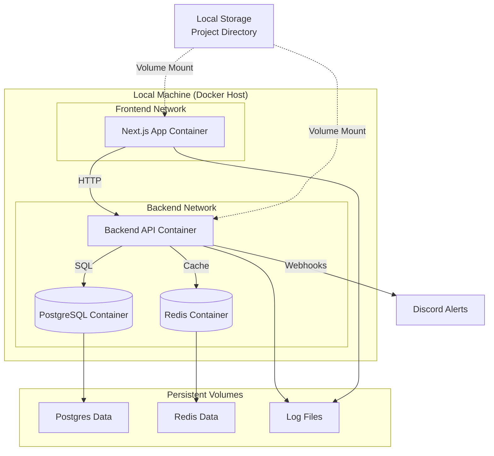

# Design Document: Distributed Infrastructure with Logging

## Overview

This design implements a distributed Docker infrastructure with centralized logging, Discord alerting, atomic credit transactions, and resource metering. The system prioritizes debuggability, atomicity, performance, and maintainability.

**Key Design Decisions:**

1. **Pino for Logging**: Selected for high performance (10,000+ logs/second) and minimal overhead
2. **PostgreSQL Row Locking**: Using `SELECT FOR NO KEY UPDATE` for atomic credit transactions
3. **Docker Health Checks**: 30-second intervals with 3-retry threshold before restart
4. **Rate Limiting**: In-memory cache with TTL for Discord alert throttling
5. **Network Isolation**: Separate Docker networks for frontend/backend with controlled communication

**Architecture Philosophy:**

- Code resides locally on the same machine
- Processing happens locally via Docker containers
- All operations are atomic and auditable
- Logging is structured (JSON) for machine parsing
- Alerts are rate-limited to prevent spam

## Architecture



## Components and Interfaces

### 1. Docker Infrastructure Manager

**Responsibility**: Orchestrate containers, health checks, and networking

**Configuration Structure** (docker-compose.yml):

```yaml
services:
    app:
        image: node:20-alpine
        volumes:
            - type: bind
              source: ./src/app
              target: /app
        networks:
            - frontend
        healthcheck:
            test:
                [
                    "CMD",
                    "wget",
                    "--quiet",
                    "--tries=1",
                    "--spider",
                    "http://localhost:3000/api/health",
                ]
            interval: 30s
            timeout: 10s
            retries: 3
            start_period: 40s
        restart: unless-stopped
        deploy:
            restart_policy:
                condition: on-failure
                max_attempts: 5
                window: 600s

    backend:
        image: node:20-alpine
        volumes:
            - type: bind
              source: ./src/backend
              target: /app
        networks:
            - frontend
            - backend
        depends_on:
            postgres:
                condition: service_healthy
            redis:
                condition: service_healthy
        healthcheck:
            test:
                [
                    "CMD",
                    "wget",
                    "--quiet",
                    "--tries=1",
                    "--spider",
                    "http://localhost:4000/health",
                ]
            interval: 30s
            timeout: 10s
            retries: 3
        restart: unless-stopped

    postgres:
        image: postgres:16-alpine
        volumes:
            - postgres_data:/var/lib/postgresql/data
        networks:
            - backend
        healthcheck:
            test: ["CMD-SHELL", "pg_isready -U ${POSTGRES_USER}"]
            interval: 30s
            timeout: 5s
            retries: 3
        restart: unless-stopped

    redis:
        image: redis:7-alpine
        volumes:
            - redis_data:/data
        networks:
            - backend
        healthcheck:
            test: ["CMD", "redis-cli", "ping"]
            interval: 30s
            timeout: 3s
            retries: 3
        restart: unless-stopped

networks:
    frontend:
        driver: bridge
    backend:
        driver: bridge
        internal: true

volumes:
    postgres_data:
    redis_data:
    log_data:
```

**Key Design Choices:**

- `restart: unless-stopped` ensures containers restart after host reboot
- `max_attempts: 5` within `window: 600s` prevents infinite restart loops
- `start_period: 40s` allows app initialization before health checks fail
- `internal: true` on backend network prevents external access to databases
- Named volumes ensure data persistence across container recreations

### 2. Logger Component

**Responsibility**: Centralized structured logging with environment-aware formatting

**Interface**:

```typescript
interface Logger {
    debug(message: string, context?: Record<string, any>): void
    info(message: string, context?: Record<string, any>): void
    warn(message: string, context?: Record<string, any>): void
    error(message: string, error?: Error, context?: Record<string, any>): void
    fatal(message: string, error?: Error, context?: Record<string, any>): void
}

interface LogEntry {
    timestamp: string // ISO 8601 format
    level: "debug" | "info" | "warn" | "error" | "fatal"
    message: string
    context?: Record<string, any>
    requestId?: string
    userId?: string
    stack?: string
}
```

**Implementation** (using Pino):

```typescript
import pino from "pino"
import pinoPretty from "pino-pretty"

const isDevelopment = process.env.NODE_ENV === "development"
const isDebugEnabled = process.env.DEBUG === "true"

const logger = pino(
    {
        level: isDebugEnabled ? "debug" : "info",
        formatters: {
            level: label => ({ level: label }),
        },
        timestamp: pino.stdTimeFunctions.isoTime,
        base: {
            pid: process.pid,
            hostname: process.env.HOSTNAME,
        },
    },
    isDevelopment
        ? pinoPretty({
              colorize: true,
              translateTime: "SYS:standard",
              ignore: "pid,hostname",
          })
        : undefined
)

export const createLogger = (context: string) => {
    return {
        debug: (message: string, meta?: Record<string, any>) => {
            if (isDebugEnabled) {
                logger.debug({ context, ...meta }, message)
            }
        },
        info: (message: string, meta?: Record<string, any>) => {
            logger.info({ context, ...meta }, message)
        },
        warn: (message: string, meta?: Record<string, any>) => {
            logger.warn({ context, ...meta }, message)
        },
        error: (message: string, error?: Error, meta?: Record<string, any>) => {
            logger.error({ context, err: error, ...meta }, message)
        },
        fatal: (message: string, error?: Error, meta?: Record<string, any>) => {
            logger.fatal({ context, err: error, ...meta }, message)
        },
    }
}
```

**Key Features:**

- Pino chosen for performance (minimal overhead, async processing)
- JSON output in production for machine parsing
- Pretty-printed colorized output in development
- Debug logs suppressed unless DEBUG=true
- Context parameter allows component-specific logging
- Stack traces automatically included for errors via `err` serializer

### 3. Discord Alerter Component

**Responsibility**: Send rate-limited alerts to Discord for critical events

**Interface**:

```typescript
interface DiscordAlerter {
    sendAlert(alert: Alert): Promise<void>
}

interface Alert {
    level: "error" | "fatal" | "startup" | "shutdown"
    title: string
    message: string
    context?: Record<string, any>
    stack?: string
}

interface RateLimiter {
    shouldAllow(key: string): boolean
}
```

**Implementation**:

````typescript
import { createLogger } from "./logger"

const logger = createLogger("DiscordAlerter")

class InMemoryRateLimiter implements RateLimiter {
    private cache = new Map<string, number>()
    private readonly windowMs = 60000 // 1 minute

    shouldAllow(key: string): boolean {
        const now = Date.now()
        const lastSent = this.cache.get(key)

        if (!lastSent || now - lastSent >= this.windowMs) {
            this.cache.set(key, now)
            // Cleanup old entries
            for (const [k, v] of this.cache.entries()) {
                if (now - v >= this.windowMs) {
                    this.cache.delete(k)
                }
            }
            return true
        }

        logger.debug("Rate limit hit", { key, lastSent, now })
        return false
    }
}

class DiscordAlerterImpl implements DiscordAlerter {
    private webhookUrl: string
    private rateLimiter: RateLimiter

    constructor(webhookUrl: string) {
        this.webhookUrl = webhookUrl
        this.rateLimiter = new InMemoryRateLimiter()
    }

    async sendAlert(alert: Alert): Promise<void> {
        const rateLimitKey = `${alert.level}:${alert.title}`

        if (!this.rateLimiter.shouldAllow(rateLimitKey)) {
            logger.debug("Alert suppressed by rate limiter", { alert })
            return
        }

        const embed = this.createEmbed(alert)

        try {
            const response = await fetch(this.webhookUrl, {
                method: "POST",
                headers: { "Content-Type": "application/json" },
                body: JSON.stringify({ embeds: [embed] }),
            })

            if (!response.ok) {
                logger.error(
                    "Failed to send Discord alert",
                    new Error(`HTTP ${response.status}`),
                    {
                        alert,
                        status: response.status,
                    }
                )
            }
        } catch (error) {
            logger.error("Discord webhook request failed", error as Error, {
                alert,
            })
        }
    }

    private createEmbed(alert: Alert) {
        const colors = {
            error: 0xffa500, // Orange
            fatal: 0xff0000, // Red
            startup: 0x00ff00, // Green
            shutdown: 0x0000ff, // Blue
        }

        return {
            title: alert.title,
            description: alert.message,
            color: colors[alert.level],
            fields: [
                ...(alert.context
                    ? [
                          {
                              name: "Context",
                              value:
                                  "```json\n" +
                                  JSON.stringify(alert.context, null, 2) +
                                  "\n```",
                          },
                      ]
                    : []),
                ...(alert.stack
                    ? [
                          {
                              name: "Stack Trace",
                              value:
                                  "```\n" +
                                  alert.stack.substring(0, 1000) +
                                  "\n```",
                          },
                      ]
                    : []),
            ],
            timestamp: new Date().toISOString(),
        }
    }
}
````

**Key Design Choices:**

- In-memory rate limiting (1 alert/minute per context)
- Rate limit key combines level and title for granular control
- Automatic cleanup of expired rate limit entries
- Non-blocking: failures don't crash the application
- Embed format with color coding for quick visual identification
- Stack traces truncated to 1000 chars to fit Discord limits

### 4. Credit System Component

**Responsibility**: Atomic credit transactions with balance validation

**Interface**:

```typescript
interface CreditSystem {
    getBalance(userId: string): Promise<number>
    debit(
        userId: string,
        amount: number,
        reason: string
    ): Promise<TransactionResult>
    credit(
        userId: string,
        amount: number,
        reason: string
    ): Promise<TransactionResult>
    getTransactionHistory(
        userId: string,
        limit?: number
    ): Promise<Transaction[]>
}

interface TransactionResult {
    success: boolean
    transactionId?: string
    newBalance?: number
    error?: string
}

interface Transaction {
    id: string
    userId: string
    amount: number
    type: "debit" | "credit"
    reason: string
    balanceBefore: number
    balanceAfter: number
    timestamp: Date
}
```

**Database Schema**:

```sql
CREATE TABLE user_accounts (
  user_id VARCHAR(255) PRIMARY KEY,
  balance DECIMAL(10, 2) NOT NULL DEFAULT 0.00,
  created_at TIMESTAMP NOT NULL DEFAULT NOW(),
  updated_at TIMESTAMP NOT NULL DEFAULT NOW(),
  CONSTRAINT positive_balance CHECK (balance >= 0)
);

CREATE TABLE transactions (
  id UUID PRIMARY KEY DEFAULT gen_random_uuid(),
  user_id VARCHAR(255) NOT NULL REFERENCES user_accounts(user_id),
  amount DECIMAL(10, 2) NOT NULL,
  type VARCHAR(10) NOT NULL CHECK (type IN ('debit', 'credit')),
  reason TEXT NOT NULL,
  balance_before DECIMAL(10, 2) NOT NULL,
  balance_after DECIMAL(10, 2) NOT NULL,
  created_at TIMESTAMP NOT NULL DEFAULT NOW(),
  INDEX idx_user_transactions (user_id, created_at DESC)
);
```

**Implementation**:

```typescript
import { Pool } from "pg"
import { createLogger } from "./logger"

const logger = createLogger("CreditSystem")

class CreditSystemImpl implements CreditSystem {
    constructor(private pool: Pool) {}

    async getBalance(userId: string): Promise<number> {
        const result = await this.pool.query(
            "SELECT balance FROM user_accounts WHERE user_id = $1",
            [userId]
        )
        return result.rows[0]?.balance ?? 0
    }

    async debit(
        userId: string,
        amount: number,
        reason: string
    ): Promise<TransactionResult> {
        const client = await this.pool.connect()

        try {
            await client.query("BEGIN")

            // Lock row and get current balance
            const lockResult = await client.query(
                "SELECT balance FROM user_accounts WHERE user_id = $1 FOR NO KEY UPDATE",
                [userId]
            )

            if (lockResult.rows.length === 0) {
                await client.query("ROLLBACK")
                return { success: false, error: "User account not found" }
            }

            const balanceBefore = parseFloat(lockResult.rows[0].balance)

            // Validate sufficient balance
            if (balanceBefore < amount) {
                await client.query("ROLLBACK")
                logger.warn("Insufficient balance", {
                    userId,
                    amount,
                    balanceBefore,
                })
                return { success: false, error: "Insufficient balance" }
            }

            const balanceAfter = balanceBefore - amount

            // Update balance
            await client.query(
                "UPDATE user_accounts SET balance = $1, updated_at = NOW() WHERE user_id = $2",
                [balanceAfter, userId]
            )

            // Record transaction
            const txResult = await client.query(
                `INSERT INTO transactions (user_id, amount, type, reason, balance_before, balance_after)
         VALUES ($1, $2, 'debit', $3, $4, $5)
         RETURNING id`,
                [userId, amount, reason, balanceBefore, balanceAfter]
            )

            await client.query("COMMIT")

            logger.info("Debit successful", {
                userId,
                amount,
                reason,
                transactionId: txResult.rows[0].id,
                balanceAfter,
            })

            return {
                success: true,
                transactionId: txResult.rows[0].id,
                newBalance: balanceAfter,
            }
        } catch (error) {
            await client.query("ROLLBACK")
            logger.error("Debit transaction failed", error as Error, {
                userId,
                amount,
                reason,
            })
            return { success: false, error: "Transaction failed" }
        } finally {
            client.release()
        }
    }

    async credit(
        userId: string,
        amount: number,
        reason: string
    ): Promise<TransactionResult> {
        const client = await this.pool.connect()

        try {
            await client.query("BEGIN")

            // Lock row and get current balance (or create account)
            const lockResult = await client.query(
                `INSERT INTO user_accounts (user_id, balance) VALUES ($1, 0)
         ON CONFLICT (user_id) DO UPDATE SET user_id = EXCLUDED.user_id
         RETURNING balance`,
                [userId]
            )

            await client.query(
                "SELECT balance FROM user_accounts WHERE user_id = $1 FOR NO KEY UPDATE",
                [userId]
            )

            const balanceBefore = parseFloat(lockResult.rows[0].balance)
            const balanceAfter = balanceBefore + amount

            // Update balance
            await client.query(
                "UPDATE user_accounts SET balance = $1, updated_at = NOW() WHERE user_id = $2",
                [balanceAfter, userId]
            )

            // Record transaction
            const txResult = await client.query(
                `INSERT INTO transactions (user_id, amount, type, reason, balance_before, balance_after)
         VALUES ($1, $2, 'credit', $3, $4, $5)
         RETURNING id`,
                [userId, amount, reason, balanceBefore, balanceAfter]
            )

            await client.query("COMMIT")

            logger.info("Credit successful", {
                userId,
                amount,
                reason,
                transactionId: txResult.rows[0].id,
                balanceAfter,
            })

            return {
                success: true,
                transactionId: txResult.rows[0].id,
                newBalance: balanceAfter,
            }
        } catch (error) {
            await client.query("ROLLBACK")
            logger.error("Credit transaction failed", error as Error, {
                userId,
                amount,
                reason,
            })
            return { success: false, error: "Transaction failed" }
        } finally {
            client.release()
        }
    }

    async getTransactionHistory(
        userId: string,
        limit = 100
    ): Promise<Transaction[]> {
        const result = await this.pool.query(
            `SELECT * FROM transactions 
       WHERE user_id = $1 
       ORDER BY created_at DESC 
       LIMIT $2`,
            [userId, limit]
        )

        return result.rows.map(row => ({
            id: row.id,
            userId: row.user_id,
            amount: parseFloat(row.amount),
            type: row.type,
            reason: row.reason,
            balanceBefore: parseFloat(row.balance_before),
            balanceAfter: parseFloat(row.balance_after),
            timestamp: row.created_at,
        }))
    }
}
```

**Key Design Choices:**

- `FOR NO KEY UPDATE` lock prevents concurrent modifications without blocking foreign key checks
- Balance validation happens within transaction after acquiring lock
- Database constraint `CHECK (balance >= 0)` as final safety net
- All operations logged for audit trail
- Transaction history maintained indefinitely for compliance
- Credit operation creates account if it doesn't exist (upsert pattern)

### 5. Metering System Component

**Responsibility**: Track resource usage and convert to billable units

**Interface**:

```typescript
interface MeteringSystem {
    recordBandwidth(userId: string, bytes: number): Promise<void>
    recordStorage(userId: string, bytes: number): Promise<void>
    recordCacheOp(
        userId: string,
        operation: "hit" | "miss" | "set"
    ): Promise<void>
    recordApiCall(userId: string, endpoint: string): Promise<void>
    aggregateDaily(): Promise<AggregationResult>
}

interface UsageMetric {
    userId: string
    metricType: "bandwidth" | "storage" | "cache_ops" | "api_calls"
    value: number
    unit: string
    timestamp: Date
}

interface AggregationResult {
    usersProcessed: number
    totalCost: number
    errors: string[]
}
```

**Database Schema**:

```sql
CREATE TABLE usage_metrics (
  id UUID PRIMARY KEY DEFAULT gen_random_uuid(),
  user_id VARCHAR(255) NOT NULL,
  metric_type VARCHAR(50) NOT NULL,
  value DECIMAL(15, 2) NOT NULL,
  unit VARCHAR(20) NOT NULL,
  created_at TIMESTAMP NOT NULL DEFAULT NOW(),
  INDEX idx_user_metrics (user_id, created_at DESC),
  INDEX idx_aggregation (created_at, user_id)
);

CREATE TABLE daily_usage_summary (
  id UUID PRIMARY KEY DEFAULT gen_random_uuid(),
  user_id VARCHAR(255) NOT NULL,
  date DATE NOT NULL,
  bandwidth_gb DECIMAL(10, 4) NOT NULL DEFAULT 0,
  storage_gb DECIMAL(10, 4) NOT NULL DEFAULT 0,
  cache_ops INTEGER NOT NULL DEFAULT 0,
  api_calls INTEGER NOT NULL DEFAULT 0,
  total_cost DECIMAL(10, 2) NOT NULL DEFAULT 0,
  created_at TIMESTAMP NOT NULL DEFAULT NOW(),
  UNIQUE (user_id, date)
);

CREATE TABLE pricing_config (
  metric_type VARCHAR(50) PRIMARY KEY,
  cost_per_unit DECIMAL(10, 6) NOT NULL,
  unit VARCHAR(20) NOT NULL,
  updated_at TIMESTAMP NOT NULL DEFAULT NOW()
);

-- Default pricing
INSERT INTO pricing_config (metric_type, cost_per_unit, unit) VALUES
  ('bandwidth', 0.10, 'GB'),
  ('storage', 0.05, 'GB'),
  ('cache_ops', 0.0001, 'operation'),
  ('api_calls', 0.001, 'call');
```

**Implementation**:

```typescript
import { Pool } from "pg"
import { createLogger } from "./logger"
import { CreditSystem } from "./credits"

const logger = createLogger("MeteringSystem")

class MeteringSystemImpl implements MeteringSystem {
    constructor(
        private pool: Pool,
        private creditSystem: CreditSystem
    ) {}

    async recordBandwidth(userId: string, bytes: number): Promise<void> {
        logger.debug("Recording bandwidth", { userId, bytes })

        await this.pool.query(
            `INSERT INTO usage_metrics (user_id, metric_type, value, unit)
       VALUES ($1, 'bandwidth', $2, 'bytes')`,
            [userId, bytes]
        )
    }

    async recordStorage(userId: string, bytes: number): Promise<void> {
        logger.debug("Recording storage", { userId, bytes })

        await this.pool.query(
            `INSERT INTO usage_metrics (user_id, metric_type, value, unit)
       VALUES ($1, 'storage', $2, 'bytes')`,
            [userId, bytes]
        )
    }

    async recordCacheOp(
        userId: string,
        operation: "hit" | "miss" | "set"
    ): Promise<void> {
        logger.debug("Recording cache operation", { userId, operation })

        await this.pool.query(
            `INSERT INTO usage_metrics (user_id, metric_type, value, unit)
       VALUES ($1, 'cache_ops', 1, 'operation')`,
            [userId]
        )
    }

    async recordApiCall(userId: string, endpoint: string): Promise<void> {
        logger.debug("Recording API call", { userId, endpoint })

        await this.pool.query(
            `INSERT INTO usage_metrics (user_id, metric_type, value, unit)
       VALUES ($1, 'api_calls', 1, 'call')`,
            [userId]
        )
    }

    async aggregateDaily(): Promise<AggregationResult> {
        const yesterday = new Date()
        yesterday.setDate(yesterday.getDate() - 1)
        const dateStr = yesterday.toISOString().split("T")[0]

        logger.info("Starting daily aggregation", { date: dateStr })

        const client = await this.pool.connect()
        const errors: string[] = []
        let usersProcessed = 0
        let totalCost = 0

        try {
            await client.query("BEGIN")

            // Get pricing config
            const pricingResult = await client.query(
                "SELECT * FROM pricing_config"
            )
            const pricing = new Map(
                pricingResult.rows.map(row => [
                    row.metric_type,
                    {
                        costPerUnit: parseFloat(row.cost_per_unit),
                        unit: row.unit,
                    },
                ])
            )

            // Aggregate metrics by user for yesterday
            const metricsResult = await client.query(
                `SELECT 
          user_id,
          metric_type,
          SUM(value) as total_value
         FROM usage_metrics
         WHERE created_at >= $1::date AND created_at < ($1::date + interval '1 day')
         GROUP BY user_id, metric_type`,
                [dateStr]
            )

            // Group by user
            const userMetrics = new Map<string, Map<string, number>>()
            for (const row of metricsResult.rows) {
                if (!userMetrics.has(row.user_id)) {
                    userMetrics.set(row.user_id, new Map())
                }
                userMetrics
                    .get(row.user_id)!
                    .set(row.metric_type, parseFloat(row.total_value))
            }

            // Process each user
            for (const [userId, metrics] of userMetrics) {
                try {
                    const bandwidthBytes = metrics.get("bandwidth") ?? 0
                    const storageBytes = metrics.get("storage") ?? 0
                    const cacheOps = metrics.get("cache_ops") ?? 0
                    const apiCalls = metrics.get("api_calls") ?? 0

                    // Convert to billable units
                    const bandwidthGb = bandwidthBytes / 1024 ** 3
                    const storageGb = storageBytes / 1024 ** 3

                    // Calculate costs
                    const bandwidthCost =
                        bandwidthGb * pricing.get("bandwidth")!.costPerUnit
                    const storageCost =
                        storageGb * pricing.get("storage")!.costPerUnit
                    const cacheOpsCost =
                        cacheOps * pricing.get("cache_ops")!.costPerUnit
                    const apiCallsCost =
                        apiCalls * pricing.get("api_calls")!.costPerUnit

                    const userTotalCost =
                        bandwidthCost +
                        storageCost +
                        cacheOpsCost +
                        apiCallsCost

                    // Insert summary
                    await client.query(
                        `INSERT INTO daily_usage_summary 
             (user_id, date, bandwidth_gb, storage_gb, cache_ops, api_calls, total_cost)
             VALUES ($1, $2, $3, $4, $5, $6, $7)
             ON CONFLICT (user_id, date) DO UPDATE SET
               bandwidth_gb = EXCLUDED.bandwidth_gb,
               storage_gb = EXCLUDED.storage_gb,
               cache_ops = EXCLUDED.cache_ops,
               api_calls = EXCLUDED.api_calls,
               total_cost = EXCLUDED.total_cost`,
                        [
                            userId,
                            dateStr,
                            bandwidthGb,
                            storageGb,
                            cacheOps,
                            apiCalls,
                            userTotalCost,
                        ]
                    )

                    // Debit from user account
                    if (userTotalCost > 0) {
                        const result = await this.creditSystem.debit(
                            userId,
                            userTotalCost,
                            `Daily usage for ${dateStr}`
                        )

                        if (!result.success) {
                            errors.push(
                                `Failed to debit user ${userId}: ${result.error}`
                            )
                            logger.warn(
                                "Failed to debit user for daily usage",
                                {
                                    userId,
                                    cost: userTotalCost,
                                    error: result.error,
                                }
                            )
                        }
                    }

                    usersProcessed++
                    totalCost += userTotalCost
                } catch (error) {
                    const errorMsg = `Error processing user ${userId}: ${(error as Error).message}`
                    errors.push(errorMsg)
                    logger.error(
                        "Error processing user metrics",
                        error as Error,
                        { userId }
                    )
                }
            }

            await client.query("COMMIT")

            logger.info("Daily aggregation complete", {
                date: dateStr,
                usersProcessed,
                totalCost,
                errorCount: errors.length,
            })

            return { usersProcessed, totalCost, errors }
        } catch (error) {
            await client.query("ROLLBACK")
            logger.error("Daily aggregation failed", error as Error)
            throw error
        } finally {
            client.release()
        }
    }
}
```

**Key Design Choices:**

- Raw metrics logged immediately for transparency
- Aggregation runs daily via cron (not real-time to reduce load)
- Conversion to billable units (bytes → GB) happens during aggregation
- Pricing stored in database for easy updates without code changes
- Failed debits logged but don't stop aggregation for other users
- Summary table provides quick access to historical usage
- Upsert pattern allows re-running aggregation for same date

## Data Models

### Environment Configuration

```typescript
interface EnvironmentConfig {
    // Application
    NODE_ENV: "development" | "production"
    DEBUG: boolean
    PORT: number

    // Database
    DATABASE_URL: string
    POSTGRES_USER: string
    POSTGRES_PASSWORD: string
    POSTGRES_DB: string

    // Redis
    REDIS_URL: string

    // Discord
    DISCORD_WEBHOOK_URL: string

    // Docker
    HOSTNAME: string
}

// Validation function
function validateEnv(): EnvironmentConfig {
    const required = ["DATABASE_URL", "REDIS_URL", "DISCORD_WEBHOOK_URL"]

    const missing = required.filter(key => !process.env[key])

    if (missing.length > 0) {
        throw new Error(
            `Missing required environment variables: ${missing.join(", ")}`
        )
    }

    return {
        NODE_ENV: (process.env.NODE_ENV as any) ?? "development",
        DEBUG: process.env.DEBUG === "true",
        PORT: parseInt(process.env.PORT ?? "4000", 10),
        DATABASE_URL: process.env.DATABASE_URL!,
        POSTGRES_USER: process.env.POSTGRES_USER ?? "postgres",
        POSTGRES_PASSWORD: process.env.POSTGRES_PASSWORD!,
        POSTGRES_DB: process.env.POSTGRES_DB ?? "app",
        REDIS_URL: process.env.REDIS_URL!,
        DISCORD_WEBHOOK_URL: process.env.DISCORD_WEBHOOK_URL!,
        HOSTNAME: process.env.HOSTNAME ?? "unknown",
    }
}
```

### Request Context

```typescript
interface RequestContext {
    requestId: string
    userId?: string
    startTime: number
    path: string
    method: string
}

// Middleware to attach context
function contextMiddleware(req: Request, res: Response, next: NextFunction) {
    const requestId =
        (req.headers["x-request-id"] as string) ?? crypto.randomUUID()
    const userId = req.headers["x-user-id"] as string

    req.context = {
        requestId,
        userId,
        startTime: Date.now(),
        path: req.path,
        method: req.method,
    }

    res.setHeader("X-Request-ID", requestId)
    next()
}
```

### Health Check Response

```typescript
interface HealthCheckResponse {
    status: "healthy" | "unhealthy"
    timestamp: string
    uptime: number
    checks: {
        database: CheckResult
        redis: CheckResult
        memory: CheckResult
    }
}

interface CheckResult {
    status: "pass" | "fail"
    message?: string
    responseTime?: number
}
```

## Correctness Properties

_A property is a characteristic or behavior that should hold true across all valid executions of a system—essentially, a formal statement about what the system should do. Properties serve as the bridge between human-readable specifications and machine-verifiable correctness guarantees._

### Property Reflection

After analyzing all acceptance criteria, I identified the following redundancies:

- Requirements 3.3 is redundant with 3.2 (rate limiting behavior)
- Requirements 4.3 is redundant with 4.2 (insufficient balance handling)
- Requirements 5.9 is redundant with 5.8 (credit system integration)
- Requirements 8.4 is redundant with 8.3 (missing env var handling)
- Requirements 8.5 is redundant with 2.4, 2.5 (DEBUG flag)
- Requirements 8.6 is redundant with 3.6 (Discord webhook URL)
- Requirements 10.1 is redundant with 3.2 (rate limiting)
- Requirements 12.1 is redundant with 2.5 (debug logging)

These redundant criteria will not have separate properties as they are already validated by other properties.

### Logger Properties

Property 1: Production logs are valid JSON
_For any_ log entry emitted in production environment, the output should be valid JSON that can be parsed without errors
**Validates: Requirements 2.1**

Property 2: Debug logs respect DEBUG flag (suppression)
_For any_ debug log call when DEBUG environment variable is false, no output should be produced
**Validates: Requirements 2.4**

Property 3: Debug logs respect DEBUG flag (emission)
_For any_ debug log call when DEBUG environment variable is true, output should be produced
**Validates: Requirements 2.5**

Property 4: Log entries contain required fields
_For any_ log entry at any level, the output should contain timestamp, level, context, and message fields
**Validates: Requirements 2.6**

Property 5: Error logs include stack traces
_For any_ error or fatal level log with an Error object, the output should include a stack trace
**Validates: Requirements 2.7**

Property 6: Request context propagation
_For any_ log emitted within a request context, the log should include the requestId field
**Validates: Requirements 12.2**

Property 7: User context propagation
_For any_ log emitted when user context is available, the log should include the userId field
**Validates: Requirements 12.3**

Property 8: Performance timing in debug logs
_For any_ debug log emitted within a request context, the log should include performance timing information
**Validates: Requirements 12.7**

Property 9: Slow query logging
_For any_ database query that takes longer than 1 second, a warning log should be emitted
**Validates: Requirements 12.5**

Property 10: Sensitive data exclusion
_For any_ log entry, sensitive environment variables (passwords, tokens, secrets) should not appear in the output
**Validates: Requirements 8.9**

### Discord Alerter Properties

Property 11: Alert level filtering
_For any_ alert sent to Discord, the alert level should be one of: error, fatal, startup, or shutdown
**Validates: Requirements 3.1**

Property 12: Rate limiting enforcement
_For any_ sequence of alerts with the same context key within a 1-minute window, only the first alert should be sent to Discord
**Validates: Requirements 3.2**

Property 13: Discord embed formatting
_For any_ alert sent to Discord, the payload should be a valid Discord embed with color coding matching the severity level
**Validates: Requirements 3.4**

Property 14: Stack traces in critical alerts
_For any_ error or fatal alert that includes a stack trace, the Discord embed should contain the stack trace in a code block
**Validates: Requirements 3.5**

Property 15: Non-blocking alert failures
_For any_ Discord webhook failure, the application should continue executing without throwing an error
**Validates: Requirements 3.7**

Property 16: Rate limit suppression logging
_For any_ alert suppressed by rate limiting, a debug log should be emitted
**Validates: Requirements 10.3**

Property 17: Rate limit expiration
_For any_ rate-limited context, after 60 seconds have elapsed, a new alert with the same context should be allowed
**Validates: Requirements 10.4**

Property 18: Independent context rate limiting
_For any_ two alerts with different context keys, the rate limit of one should not affect the other
**Validates: Requirements 10.5**

### Credit System Properties

Property 19: Insufficient balance rejection
_For any_ debit operation where the requested amount exceeds the current balance, the transaction should fail and return an error
**Validates: Requirements 4.2**

Property 20: Balance non-negativity invariant
_For any_ sequence of credit and debit operations, the user balance should never become negative
**Validates: Requirements 4.4**

Property 21: Transaction logging completeness
_For any_ completed transaction (credit or debit), a log entry should be created containing user_id, amount, type, and timestamp
**Validates: Requirements 4.5**

Property 22: Transaction rollback on failure
_For any_ transaction that encounters an error, the database state should be unchanged (balance and transaction history)
**Validates: Requirements 4.7**

Property 23: Transaction history persistence
_For any_ completed transaction, a record should exist in the transactions table with all transaction details
**Validates: Requirements 4.8**

### Metering System Properties

Property 24: Bandwidth recording persistence
_For any_ bandwidth usage recording, a corresponding entry should be created in the usage_metrics table with metric_type='bandwidth'
**Validates: Requirements 5.1**

Property 25: Storage recording persistence
_For any_ storage usage recording, a corresponding entry should be created in the usage_metrics table with metric_type='storage'
**Validates: Requirements 5.2**

Property 26: Cache operation recording
_For any_ cache operation (hit, miss, or set), a corresponding entry should be created in the usage_metrics table with metric_type='cache_ops'
**Validates: Requirements 5.3**

Property 27: API call recording
_For any_ API call, a corresponding entry should be created in the usage_metrics table with metric_type='api_calls'
**Validates: Requirements 5.4**

Property 28: Raw usage value logging
_For any_ usage recording operation, a debug log should be emitted containing the raw usage value
**Validates: Requirements 5.5**

Property 29: Unit conversion accuracy
_For any_ aggregation of bandwidth or storage metrics, the conversion from bytes to gigabytes should be accurate (bytes / 1024^3)
**Validates: Requirements 5.6**

Property 30: Cost calculation and billing
_For any_ user with recorded usage during daily aggregation, the total cost should be calculated correctly and debited from their credit balance
**Validates: Requirements 5.8**

### Environment Configuration Properties

Property 31: Required environment variable validation
_For any_ application startup, if any required environment variable is missing, the startup should fail with a clear error message listing the missing variables
**Validates: Requirements 8.3**

## Error Handling

### Error Categories

1. **Infrastructure Errors**
    - Docker container failures → Automatic restart via restart policy
    - Network connectivity issues → Retry with exponential backoff
    - Volume mount failures → Fail fast with clear error message

2. **Database Errors**
    - Connection failures → Retry with connection pool
    - Transaction deadlocks → Automatic retry (up to 3 attempts)
    - Constraint violations → Return error to caller with details
    - Query timeouts → Log slow query and return timeout error

3. **External Service Errors**
    - Discord webhook failures → Log error, continue execution
    - Redis connection failures → Degrade gracefully (skip caching)

4. **Application Errors**
    - Invalid input → Validate early, return 400 with details
    - Insufficient balance → Return error, log warning
    - Missing configuration → Fail startup with clear message

### Error Response Format

```typescript
interface ErrorResponse {
    error: {
        code: string
        message: string
        details?: Record<string, any>
        requestId: string
    }
}
```

### Retry Strategy

```typescript
interface RetryConfig {
    maxAttempts: number
    initialDelayMs: number
    maxDelayMs: number
    backoffMultiplier: number
}

const defaultRetryConfig: RetryConfig = {
    maxAttempts: 3,
    initialDelayMs: 100,
    maxDelayMs: 5000,
    backoffMultiplier: 2,
}

async function withRetry<T>(
    operation: () => Promise<T>,
    config: RetryConfig = defaultRetryConfig
): Promise<T> {
    let lastError: Error
    let delay = config.initialDelayMs

    for (let attempt = 1; attempt <= config.maxAttempts; attempt++) {
        try {
            return await operation()
        } catch (error) {
            lastError = error as Error

            if (attempt === config.maxAttempts) {
                throw lastError
            }

            logger.warn("Operation failed, retrying", {
                attempt,
                maxAttempts: config.maxAttempts,
                delay,
                error: lastError.message,
            })

            await sleep(delay)
            delay = Math.min(
                delay * config.backoffMultiplier,
                config.maxDelayMs
            )
        }
    }

    throw lastError!
}
```

### Graceful Degradation

- **Redis unavailable**: Skip caching, query database directly
- **Discord webhook down**: Log locally, continue execution
- **Slow database**: Return cached results if available, log warning

## Testing Strategy

### Dual Testing Approach

This system requires both unit tests and property-based tests for comprehensive coverage:

- **Unit tests**: Verify specific examples, edge cases, and integration points
- **Property tests**: Verify universal properties across all inputs

Both approaches are complementary and necessary. Unit tests catch concrete bugs in specific scenarios, while property tests verify general correctness across a wide range of inputs.

### Property-Based Testing Configuration

**Library Selection**: [fast-check](https://github.com/dubzzz/fast-check) for TypeScript/JavaScript

**Configuration**:

- Minimum 100 iterations per property test (due to randomization)
- Each property test must reference its design document property
- Tag format: `// Feature: distributed-infrastructure-logging, Property {number}: {property_text}`

**Example Property Test**:

```typescript
import fc from "fast-check"
import { describe, it, expect } from "vitest"
import { createLogger } from "./logger"

describe("Logger Properties", () => {
    // Feature: distributed-infrastructure-logging, Property 1: Production logs are valid JSON
    it("should output valid JSON in production", () => {
        fc.assert(
            fc.property(
                fc.record({
                    message: fc.string(),
                    context: fc.dictionary(fc.string(), fc.anything()),
                }),
                ({ message, context }) => {
                    process.env.NODE_ENV = "production"
                    const logger = createLogger("test")

                    // Capture output
                    const output = captureLogOutput(() => {
                        logger.info(message, context)
                    })

                    // Should be valid JSON
                    expect(() => JSON.parse(output)).not.toThrow()

                    const parsed = JSON.parse(output)
                    expect(parsed.message).toBe(message)
                }
            ),
            { numRuns: 100 }
        )
    })
})
```

### Unit Testing Strategy

**Focus Areas**:

1. **Configuration validation**: Test missing env vars, invalid values
2. **Edge cases**: Empty strings, null values, boundary conditions
3. **Error conditions**: Network failures, database errors, invalid input
4. **Integration points**: Docker health checks, database connections, Redis connectivity

**Example Unit Test**:

```typescript
describe("Environment Configuration", () => {
    it("should fail startup when DISCORD_WEBHOOK_URL is missing", () => {
        delete process.env.DISCORD_WEBHOOK_URL

        expect(() => validateEnv()).toThrow(
            "Missing required environment variables: DISCORD_WEBHOOK_URL"
        )
    })

    it("should parse DEBUG flag correctly", () => {
        process.env.DEBUG = "true"
        const config = validateEnv()
        expect(config.DEBUG).toBe(true)

        process.env.DEBUG = "false"
        const config2 = validateEnv()
        expect(config2.DEBUG).toBe(false)
    })
})
```

### Integration Testing

**Docker Compose Tests**:

- Verify all containers start successfully
- Verify health checks pass
- Verify inter-container communication
- Verify volume persistence after container restart

**Database Tests**:

- Verify transaction atomicity under concurrent load
- Verify row locking prevents race conditions
- Verify constraint enforcement (positive balance)

**End-to-End Tests**:

- Verify complete credit transaction flow
- Verify daily metering aggregation and billing
- Verify Discord alerts are sent for critical errors

### Test Coverage Goals

- **Unit tests**: 80% code coverage minimum
- **Property tests**: All 31 correctness properties implemented
- **Integration tests**: All critical paths covered
- **Docker tests**: All infrastructure requirements verified

### Continuous Testing

- Run unit tests on every commit
- Run property tests on every PR
- Run integration tests nightly
- Run full E2E tests before deployment
