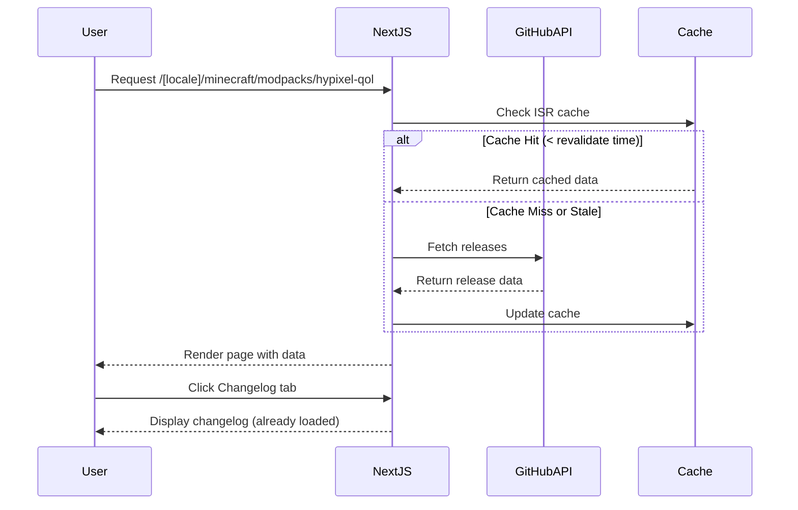

# Design Document: Hypixel-QoL Modpack Page

## Overview

This design document specifies the technical implementation for a dedicated Hypixel-QoL modpack page on gabrieltoth.com. The page will display comprehensive modpack information with a Modrinth-inspired design, featuring automatic changelog fetching from GitHub, complete mod listings (150+ mods), and multilingual support across all existing site locales (pt-BR, en, es, de).

### Technology Stack

- **Framework**: Next.js 16.2.4 with App Router
- **React**: 19.2.5
- **TypeScript**: 6.0.2
- **Styling**: Tailwind CSS 4.2.2
- **Internationalization**: next-intl 4.9.1
- **UI Components**: Radix UI (@radix-ui/react-tabs, @radix-ui/react-dialog)
- **Icons**: lucide-react 1.8.0
- **External API**: GitHub REST API v3
- **Deployment**: Vercel with ISR (Incremental Static Regeneration)

### Key Design Decisions

1. **Static Generation with ISR**: Use Next.js static generation with ISR for optimal performance while keeping changelog data fresh
2. **Component-Based Architecture**: Modular components for tabs, sidebar, mod list, and changelog
3. **GitHub API Integration**: Server-side data fetching with caching to minimize API rate limiting
4. **Modrinth-Style Design**: Replicate Modrinth's visual language using Tailwind CSS custom classes
5. **Responsive-First**: Mobile-first approach with breakpoints at 768px (tablet) and 1024px (desktop)
6. **Accessibility**: WCAG 2.1 Level AA compliance with keyboard navigation and ARIA labels

## Architecture

### High-Level Architecture

```
┌─────────────────────────────────────────────────────────────┐
│                     Next.js App Router                       │
│  /[locale]/minecraft/modpacks/hypixel-qol/page.tsx          │
└────────────────────┬────────────────────────────────────────┘
                     │
        ┌────────────┴────────────┐
        │                         │
┌───────▼────────┐      ┌────────▼─────────┐
│  Server Side   │      │   Client Side    │
│  Components    │      │   Components     │
│                │      │                  │
│ - Metadata Gen │      │ - Tab Navigation │
│ - GitHub API   │      │ - Search/Filter  │
│ - Structured   │      │ - Theme Toggle   │
│   Data         │      │ - Language       │
│ - ISR Cache    │      │   Selector       │
└───────┬────────┘      └────────┬─────────┘
        │                        │
        └────────────┬───────────┘
                     │
        ┌────────────▼────────────┐
        │   Shared Components     │
        │                         │
        │ - ModpackSidebar        │
        │ - ModList               │
        │ - ChangelogDisplay      │
        │ - KeyFeaturesSection    │
        │ - GallerySection        │
        │ - VersionsSection       │
        └─────────────────────────┘
```

### Data Flow



### File Structure

```
src/
├── app/
│   └── [locale]/
│       └── minecraft/
│           └── modpacks/
│               └── hypixel-qol/
│                   ├── page.tsx                    # Main page component
│                   ├── layout.tsx                  # Optional layout wrapper
│                   ├── hypixel-qol-metadata.ts     # Metadata generation
│                   ├── hypixel-qol-structured.ts   # Structured data (JSON-LD)
│                   ├── hypixel-qol-types.ts        # TypeScript types
│                   └── components/
│                       ├── modpack-sidebar.tsx     # Quick info sidebar
│                       ├── modpack-tabs.tsx        # Tab navigation
│                       ├── overview-section.tsx    # Overview content
│                       ├── changelog-section.tsx   # Changelog display
│                       ├── gallery-section.tsx     # Gallery/screenshots
│                       ├── versions-section.tsx    # Version history
│                       ├── mod-list.tsx            # Mod listing component
│                       ├── mod-card.tsx            # Individual mod card
│                       ├── key-features.tsx        # Key features section
│                       └── external-links.tsx      # External link buttons
├── lib/
│   └── github/
│       ├── github-api.ts                          # GitHub API client
│       ├── github-types.ts                        # GitHub API types
│       └── github-cache.ts                        # Caching utilities
├── data/
│   └── minecraft/
│       └── hypixel-qol-mods.ts                    # Static mod list data
└── i18n/
    ├── en/
    │   └── minecraft.json                         # English translations
    ├── pt-BR/
    │   └── minecraft.json                         # Portuguese translations
    ├── es/
    │   └── minecraft.json                         # Spanish translations
    └── de/
        └── minecraft.json                         # German translations
```

## Components and Interfaces

### 1. Main Page Component

**File**: `src/app/[locale]/minecraft/modpacks/hypixel-qol/page.tsx`

```typescript
interface PageProps {
  params: Promise<{ locale: Locale }>
  searchParams: Promise<{ tab?: string }>
}

export default async function HypixelQoLPage({ params, searchParams }: PageProps)
```

**Responsibilities**:
- Fetch changelog data from GitHub API
- Generate metadata for SEO
- Render structured data
- Compose layout with sidebar and main content area
- Handle ISR revalidation

### 2. Modpack Sidebar Component

**File**: `src/app/[locale]/minecraft/modpacks/hypixel-qol/components/modpack-sidebar.tsx`

```typescript
interface ModpackSidebarProps {
  locale: Locale
  version: string
  minecraftVersion: string
  modLoader: string
  installationType: string
  externalLinks: ExternalLink[]
}

interface ExternalLink {
  type: 'modrinth' | 'github' | 'paypal' | 'issues'
  url: string
  label: string
}
```

**Responsibilities**:
- Display quick information (version, compatibility, platform)
- Render external link buttons
- Show recommended JVM arguments
- Responsive layout (sidebar on desktop, top section on mobile)

### 3. Tab Navigation Component

**File**: `src/app/[locale]/minecraft/modpacks/hypixel-qol/components/modpack-tabs.tsx`

```typescript
interface ModpackTabsProps {
  locale: Locale
  defaultTab?: string
  children: React.ReactNode
}

interface TabConfig {
  id: 'overview' | 'changelog' | 'gallery' | 'versions'
  label: string
  content: React.ReactNode
}
```

**Responsibilities**:
- Render tab navigation using Radix UI Tabs
- Handle tab state with URL hash/query params
- Keyboard navigation support
- Active tab visual indication

### 4. Changelog Section Component

**File**: `src/app/[locale]/minecraft/modpacks/hypixel-qol/components/changelog-section.tsx`

```typescript
interface ChangelogSectionProps {
  locale: Locale
  releases: GitHubRelease[]
}

interface GitHubRelease {
  version: string
  tagName: string
  publishedAt: string
  body: string
  htmlUrl: string
}
```

**Responsibilities**:
- Display version history from GitHub releases
- Format markdown changelog content
- Handle loading and error states
- Link to GitHub release pages

### 5. Mod List Component

**File**: `src/app/[locale]/minecraft/modpacks/hypixel-qol/components/mod-list.tsx`

```typescript
interface ModListProps {
  locale: Locale
  mods: Mod[]
}

interface Mod {
  name: string
  category: ModCategory
  url: string
  description?: string
}

type ModCategory = 
  | 'performance'
  | 'qol'
  | 'skyblock'
  | 'visual'
  | 'utility'
```

**Responsibilities**:
- Display all 150+ mods in organized categories
- Implement search functionality
- Implement category filtering
- Show mod count
- Responsive grid layout

### 6. Key Features Component

**File**: `src/app/[locale]/minecraft/modpacks/hypixel-qol/components/key-features.tsx`

```typescript
interface KeyFeaturesProps {
  locale: Locale
}

interface Feature {
  icon: LucideIcon
  titleKey: string
  descriptionKey: string
}
```

**Responsibilities**:
- Display key modpack features with icons
- Use translation keys for multilingual support
- Responsive grid layout

## Data Models

### GitHub Release Data Model

```typescript
// src/lib/github/github-types.ts

interface GitHubRelease {
  id: number
  tagName: string
  name: string
  body: string
  draft: boolean
  prerelease: boolean
  createdAt: string
  publishedAt: string
  htmlUrl: string
  author: {
    login: string
    avatarUrl: string
  }
}

interface GitHubAPIResponse {
  releases: GitHubRelease[]
  rateLimit: {
    limit: number
    remaining: number
    reset: number
  }
}
```

### Mod Data Model

```typescript
// src/data/minecraft/hypixel-qol-mods.ts

interface Mod {
  id: string
  name: string
  category: ModCategory
  url: string
  platform: 'modrinth' | 'curseforge' | 'github'
  description?: string
  author?: string
}

type ModCategory = 
  | 'performance'
  | 'qol'
  | 'skyblock'
  | 'visual'
  | 'utility'

interface ModpackData {
  name: string
  version: string
  minecraftVersion: string
  modLoader: 'fabric' | 'forge' | 'quilt'
  installationType: 'client' | 'server' | 'both'
  mods: Mod[]
  jvmArgs: string
  externalLinks: ExternalLink[]
}
```

### Translation Data Model

```typescript
// src/i18n/[locale]/minecraft.json

interface MinecraftTranslations {
  modpacks: {
    hypixelQol: {
      title: string
      description: string
      tabs: {
        overview: string
        changelog: string
        gallery: string
        versions: string
      }
      sidebar: {
        version: string
        minecraftVersion: string
        modLoader: string
        installationType: string
        jvmArgs: string
        externalLinks: {
          modrinth: string
          github: string
          donate: string
          reportIssue: string
        }
      }
      features: {
        [key: string]: {
          title: string
          description: string
        }
      }
      modList: {
        title: string
        search: string
        filterByCategory: string
        totalMods: string
        categories: {
          performance: string
          qol: string
          skyblock: string
          visual: string
          utility: string
        }
      }
      changelog: {
        title: string
        loading: string
        error: string
        noReleases: string
        viewOnGitHub: string
      }
    }
  }
}
```

## Error Handling

### GitHub API Error Handling

```typescript
// src/lib/github/github-api.ts

class GitHubAPIError extends Error {
  constructor(
    message: string,
    public statusCode?: number,
    public rateLimit?: RateLimitInfo
  ) {
    super(message)
    this.name = 'GitHubAPIError'
  }
}

async function fetchGitHubReleases(
  repo: string
): Promise<GitHubRelease[]> {
  try {
    const response = await fetch(
      `https://api.github.com/repos/${repo}/releases`,
      {
        headers: {
          'Accept': 'application/vnd.github.v3+json',
          'User-Agent': 'gabrieltoth.com',
        },
        next: { revalidate: 3600 }, // 1 hour cache
      }
    )

    if (!response.ok) {
      if (response.status === 403) {
        // Rate limit exceeded
        const resetTime = response.headers.get('X-RateLimit-Reset')
        throw new GitHubAPIError(
          'GitHub API rate limit exceeded',
          403,
          { reset: resetTime ? parseInt(resetTime) : undefined }
        )
      }
      throw new GitHubAPIError(
        `GitHub API error: ${response.statusText}`,
        response.status
      )
    }

    return await response.json()
  } catch (error) {
    if (error instanceof GitHubAPIError) {
      throw error
    }
    throw new GitHubAPIError('Failed to fetch GitHub releases')
  }
}
```

### Component Error Boundaries

```typescript
// src/app/[locale]/minecraft/modpacks/hypixel-qol/components/changelog-section.tsx

export function ChangelogSection({ releases }: ChangelogSectionProps) {
  const t = useTranslations('minecraft.modpacks.hypixelQol.changelog')

  if (!releases || releases.length === 0) {
    return (
      <div className="text-center py-12">
        <p className="text-gray-600 dark:text-gray-400">
          {t('noReleases')}
        </p>
      </div>
    )
  }

  return (
    <div className="space-y-6">
      {releases.map((release) => (
        <ChangelogEntry key={release.id} release={release} />
      ))}
    </div>
  )
}
```

### Fallback UI for Failed Data Fetching

```typescript
// src/app/[locale]/minecraft/modpacks/hypixel-qol/page.tsx

export default async function HypixelQoLPage({ params }: PageProps) {
  const { locale } = await params
  
  let releases: GitHubRelease[] = []
  let changelogError: string | null = null

  try {
    releases = await fetchGitHubReleases('GabrielToth/Hypixel-QoL')
  } catch (error) {
    if (error instanceof GitHubAPIError) {
      changelogError = error.message
      console.error('GitHub API Error:', error)
    }
  }

  return (
    <main>
      <ModpackTabs locale={locale}>
        <OverviewSection locale={locale} />
        <ChangelogSection 
          locale={locale} 
          releases={releases}
          error={changelogError}
        />
        {/* ... other sections */}
      </ModpackTabs>
    </main>
  )
}
```

## Testing Strategy

### Testing Approach

This feature is primarily a **UI/presentation layer** with external API integration. Property-based testing is **not applicable** because:
- The feature is focused on rendering and layout (UI components)
- GitHub API integration should use integration tests with mocks
- Static content display doesn't have universal properties that vary meaningfully with input
- Responsive design should use visual regression tests

**Testing Strategy**:
1. **Unit Tests**: Component logic, data transformations, utility functions
2. **Integration Tests**: GitHub API integration with mocks
3. **E2E Tests**: User flows, tab navigation, search/filter functionality
4. **Visual Regression Tests**: Responsive design, theme switching
5. **Accessibility Tests**: WCAG compliance, keyboard navigation

### Unit Tests

**Test Framework**: Vitest with React Testing Library

**Coverage Areas**:
- Component rendering with different props
- Translation key resolution
- Data transformation functions
- Error state handling
- Search and filter logic

**Example Test**:
```typescript
// src/app/[locale]/minecraft/modpacks/hypixel-qol/components/__tests__/mod-list.test.tsx

describe('ModList', () => {
  it('should render all mods grouped by category', () => {
    const mods = [
      { id: '1', name: 'Sodium', category: 'performance', url: '...' },
      { id: '2', name: 'SkyHanni', category: 'skyblock', url: '...' },
    ]
    
    render(<ModList locale="en" mods={mods} />)
    
    expect(screen.getByText('Performance')).toBeInTheDocument()
    expect(screen.getByText('Sodium')).toBeInTheDocument()
    expect(screen.getByText('Skyblock')).toBeInTheDocument()
    expect(screen.getByText('SkyHanni')).toBeInTheDocument()
  })

  it('should filter mods by search query', async () => {
    const mods = [
      { id: '1', name: 'Sodium', category: 'performance', url: '...' },
      { id: '2', name: 'SkyHanni', category: 'skyblock', url: '...' },
    ]
    
    render(<ModList locale="en" mods={mods} />)
    
    const searchInput = screen.getByPlaceholderText(/search/i)
    await userEvent.type(searchInput, 'Sodium')
    
    expect(screen.getByText('Sodium')).toBeInTheDocument()
    expect(screen.queryByText('SkyHanni')).not.toBeInTheDocument()
  })

  it('should filter mods by category', async () => {
    const mods = [
      { id: '1', name: 'Sodium', category: 'performance', url: '...' },
      { id: '2', name: 'SkyHanni', category: 'skyblock', url: '...' },
    ]
    
    render(<ModList locale="en" mods={mods} />)
    
    const categoryFilter = screen.getByLabelText(/filter by category/i)
    await userEvent.selectOptions(categoryFilter, 'performance')
    
    expect(screen.getByText('Sodium')).toBeInTheDocument()
    expect(screen.queryByText('SkyHanni')).not.toBeInTheDocument()
  })
})
```

### Integration Tests

**Coverage Areas**:
- GitHub API integration with mocked responses
- ISR cache behavior
- Metadata generation
- Structured data generation

**Example Test**:
```typescript
// src/lib/github/__tests__/github-api.test.ts

describe('fetchGitHubReleases', () => {
  it('should fetch and parse GitHub releases', async () => {
    const mockReleases = [
      {
        id: 1,
        tag_name: 'v1.0.0',
        name: 'Release 1.0.0',
        body: 'Initial release',
        published_at: '2024-01-01T00:00:00Z',
        html_url: 'https://github.com/...',
      },
    ]

    global.fetch = vi.fn().mockResolvedValue({
      ok: true,
      json: async () => mockReleases,
      headers: new Headers(),
    })

    const releases = await fetchGitHubReleases('GabrielToth/Hypixel-QoL')

    expect(releases).toHaveLength(1)
    expect(releases[0].tagName).toBe('v1.0.0')
  })

  it('should handle rate limit errors', async () => {
    global.fetch = vi.fn().mockResolvedValue({
      ok: false,
      status: 403,
      statusText: 'Forbidden',
      headers: new Headers({
        'X-RateLimit-Reset': '1704067200',
      }),
    })

    await expect(
      fetchGitHubReleases('GabrielToth/Hypixel-QoL')
    ).rejects.toThrow('GitHub API rate limit exceeded')
  })

  it('should handle network errors', async () => {
    global.fetch = vi.fn().mockRejectedValue(new Error('Network error'))

    await expect(
      fetchGitHubReleases('GabrielToth/Hypixel-QoL')
    ).rejects.toThrow('Failed to fetch GitHub releases')
  })
})
```

### E2E Tests

**Test Framework**: Playwright

**Coverage Areas**:
- Page navigation and routing
- Tab switching with URL state
- Search and filter interactions
- External link clicks
- Language switching
- Theme switching
- Mobile responsive behavior

**Example Test**:
```typescript
// e2e/hypixel-qol-modpack.spec.ts

test.describe('Hypixel-QoL Modpack Page', () => {
  test('should navigate between tabs', async ({ page }) => {
    await page.goto('/en/minecraft/modpacks/hypixel-qol')

    // Click Changelog tab
    await page.click('button:has-text("Changelog")')
    await expect(page).toHaveURL(/tab=changelog/)
    await expect(page.locator('h2:has-text("Changelog")')).toBeVisible()

    // Click Gallery tab
    await page.click('button:has-text("Gallery")')
    await expect(page).toHaveURL(/tab=gallery/)
    await expect(page.locator('h2:has-text("Gallery")')).toBeVisible()
  })

  test('should search and filter mods', async ({ page }) => {
    await page.goto('/en/minecraft/modpacks/hypixel-qol')

    // Search for a mod
    await page.fill('input[placeholder*="Search"]', 'Sodium')
    await expect(page.locator('text=Sodium')).toBeVisible()

    // Filter by category
    await page.selectOption('select[aria-label*="category"]', 'performance')
    await expect(page.locator('text=Performance')).toBeVisible()
  })

  test('should open external links in new tab', async ({ page, context }) => {
    await page.goto('/en/minecraft/modpacks/hypixel-qol')

    const [newPage] = await Promise.all([
      context.waitForEvent('page'),
      page.click('a:has-text("Download on Modrinth")'),
    ])

    expect(newPage.url()).toContain('modrinth.com')
  })

  test('should be responsive on mobile', async ({ page }) => {
    await page.setViewportSize({ width: 375, height: 667 })
    await page.goto('/en/minecraft/modpacks/hypixel-qol')

    // Sidebar should be stacked on mobile
    const sidebar = page.locator('[data-testid="modpack-sidebar"]')
    await expect(sidebar).toBeVisible()
    
    // Tabs should be scrollable on mobile
    const tabs = page.locator('[role="tablist"]')
    await expect(tabs).toBeVisible()
  })
})
```

### Accessibility Tests

**Test Framework**: Storybook with @storybook/addon-a11y

**Coverage Areas**:
- WCAG 2.1 Level AA compliance
- Keyboard navigation
- Screen reader compatibility
- Color contrast ratios
- Focus indicators
- ARIA labels

**Example Test**:
```typescript
// src/app/[locale]/minecraft/modpacks/hypixel-qol/components/__tests__/modpack-tabs.a11y.test.tsx

describe('ModpackTabs Accessibility', () => {
  it('should be keyboard navigable', async () => {
    render(<ModpackTabs locale="en" />)

    const firstTab = screen.getByRole('tab', { name: /overview/i })
    firstTab.focus()

    // Tab key should move to next tab
    await userEvent.keyboard('{Tab}')
    expect(screen.getByRole('tab', { name: /changelog/i })).toHaveFocus()

    // Arrow keys should navigate tabs
    await userEvent.keyboard('{ArrowRight}')
    expect(screen.getByRole('tab', { name: /gallery/i })).toHaveFocus()

    // Enter should activate tab
    await userEvent.keyboard('{Enter}')
    expect(screen.getByRole('tabpanel')).toHaveAttribute('aria-labelledby', 'gallery-tab')
  })

  it('should have proper ARIA attributes', () => {
    render(<ModpackTabs locale="en" />)

    const tabList = screen.getByRole('tablist')
    expect(tabList).toHaveAttribute('aria-label')

    const tabs = screen.getAllByRole('tab')
    tabs.forEach(tab => {
      expect(tab).toHaveAttribute('aria-controls')
      expect(tab).toHaveAttribute('aria-selected')
    })

    const tabPanel = screen.getByRole('tabpanel')
    expect(tabPanel).toHaveAttribute('aria-labelledby')
  })

  it('should meet color contrast requirements', async () => {
    const { container } = render(<ModpackTabs locale="en" />)
    
    // Run axe accessibility tests
    const results = await axe(container)
    expect(results).toHaveNoViolations()
  })
})
```

### Visual Regression Tests

**Test Framework**: Playwright with screenshot comparison

**Coverage Areas**:
- Responsive layouts (mobile, tablet, desktop)
- Theme switching (light/dark mode)
- Component states (hover, focus, active)
- Locale-specific rendering

**Example Test**:
```typescript
// e2e/visual/hypixel-qol-modpack.visual.spec.ts

test.describe('Hypixel-QoL Visual Regression', () => {
  test('should match desktop layout', async ({ page }) => {
    await page.goto('/en/minecraft/modpacks/hypixel-qol')
    await expect(page).toHaveScreenshot('desktop-overview.png')
  })

  test('should match mobile layout', async ({ page }) => {
    await page.setViewportSize({ width: 375, height: 667 })
    await page.goto('/en/minecraft/modpacks/hypixel-qol')
    await expect(page).toHaveScreenshot('mobile-overview.png')
  })

  test('should match dark mode', async ({ page }) => {
    await page.goto('/en/minecraft/modpacks/hypixel-qol')
    await page.click('[data-testid="theme-toggle"]')
    await expect(page).toHaveScreenshot('dark-mode-overview.png')
  })
})
```

### Test Coverage Goals

- **Unit Tests**: 80%+ code coverage
- **Integration Tests**: All API endpoints and data flows
- **E2E Tests**: All critical user paths
- **Accessibility Tests**: 100% WCAG 2.1 Level AA compliance
- **Visual Regression Tests**: All responsive breakpoints and themes

### Continuous Integration

- Run unit tests on every commit
- Run integration tests on pull requests
- Run E2E tests on staging deployments
- Run visual regression tests on UI changes
- Generate coverage reports and enforce thresholds

