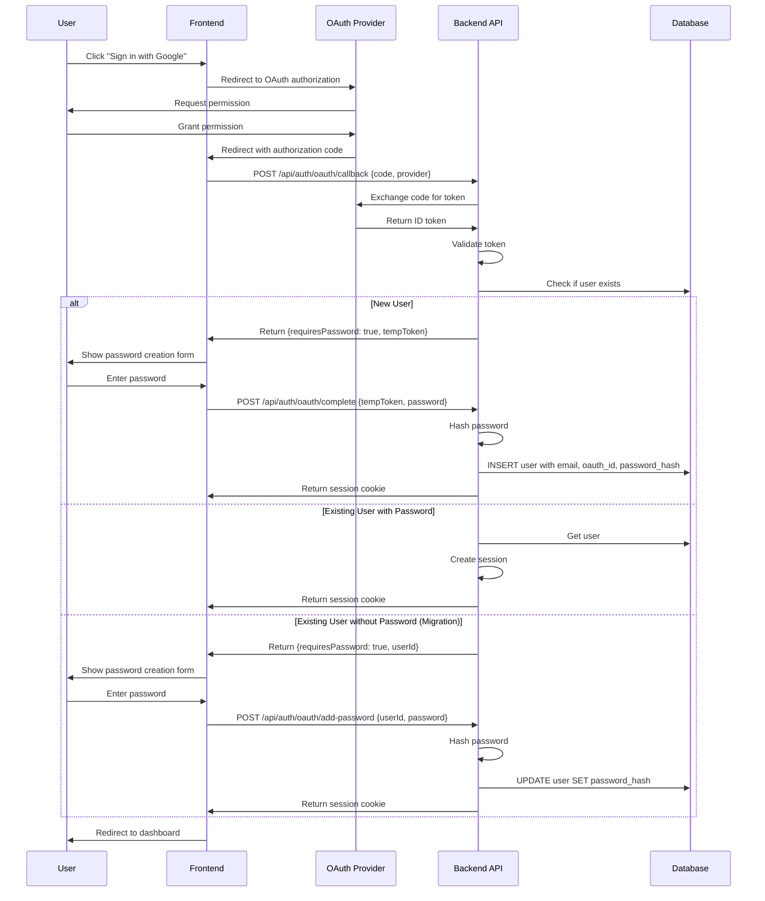

# Design Document: OAuth Password Requirement

## Overview

This design extends the existing OAuth authentication system to require all users—including those who register via OAuth providers (Google, Facebook, TikTok)—to create a password during registration. This ensures every user has both OAuth and email/password authentication methods available, providing flexibility and account recovery options.

### Current State

The system currently supports Google OAuth authentication where users can register and login using only their Google account. The `users` table in `src/lib/db/schema.sql` stores:
- `google_id` (UNIQUE NOT NULL)
- `google_email` (NOT NULL)
- `google_name` (NOT NULL)
- `google_picture` (nullable)

Users created via OAuth have no password and can only authenticate through Google.

### Target State

After this feature implementation:
1. All users will have both `email` and `password_hash` fields (NOT NULL)
2. OAuth users will create a password during registration
3. Users can authenticate via either OAuth or email/password
4. The system will support Google, Facebook, and TikTok OAuth providers
5. Existing OAuth users without passwords will be prompted to create one on next login

### Key Design Decisions

1. **Universal Password Requirement**: Every user must have a password, even OAuth users. This provides a fallback authentication method and simplifies the data model.

2. **Inline Password Creation**: Password creation happens immediately after OAuth authorization, before registration completes. This ensures atomicity and prevents incomplete user records.

3. **Email Source Priority**: For Google OAuth, we use the verified Google email. For Facebook/TikTok, we prompt for a recovery email if not provided by the OAuth provider.

4. **Backward Compatibility**: Existing OAuth users without passwords will be migrated through a forced password creation flow on their next login.

5. **Dual Authentication**: Users can login via either OAuth or email/password, with identical session permissions regardless of authentication method.

## Architecture

### High-Level Flow



### Component Architecture

```mermaid
graph TB
    subgraph "Frontend Layer"
        OAuthButton[OAuth Login Button]
        PasswordForm[Password Creation Form]
        LoginForm[Email/Password Login Form]
    end
    
    subgraph "API Layer"
        OAuthCallback[/api/auth/oauth/callback]
        OAuthComplete[/api/auth/oauth/complete]
        OAuthAddPassword[/api/auth/oauth/add-password]
        EmailLogin[/api/auth/login]
    end
    
    subgraph "Business Logic Layer"
        OAuthValidator[OAuth Token Validator]
        PasswordValidator[Password Validator]
        PasswordHasher[Password Hasher]
        UserManager[User Manager]
        SessionManager[Session Manager]
    end
    
    subgraph "Data Layer"
        UsersTable[(users table)]
        SessionsTable[(sessions table)]
        AuditTable[(audit_logs table)]
    end
    
    OAuthButton --> OAuthCallback
    PasswordForm --> OAuthComplete
    PasswordForm --> OAuthAddPassword
    LoginForm --> EmailLogin
    
    OAuthCallback --> OAuthValidator
    OAuthCallback --> UserManager
    OAuthComplete --> PasswordValidator
    OAuthComplete --> PasswordHasher
    OAuthComplete --> UserManager
    OAuthAddPassword --> PasswordValidator
    OAuthAddPassword --> PasswordHasher
    OAuthAddPassword --> UserManager
    EmailLogin --> PasswordHasher
    EmailLogin --> UserManager
    
    UserManager --> UsersTable
    SessionManager --> SessionsTable
    UserManager --> AuditTable
    
    OAuthCallback --> SessionManager
    OAuthComplete --> SessionManager
    OAuthAddPassword --> SessionManager
    EmailLogin --> SessionManager
```

## Components and Interfaces

### 1. OAuth Callback Handler

**Purpose**: Handle OAuth provider callbacks and initiate registration/login flow

**Location**: `src/app/api/auth/oauth/callback/route.ts`

**Interface**:
```typescript
// GET/POST /api/auth/oauth/callback
interface OAuthCallbackRequest {
  code: string              // Authorization code from OAuth provider
  provider: 'google' | 'facebook' | 'tiktok'
  state?: string           // CSRF protection token
}

interface OAuthCallbackResponse {
  success: boolean
  requiresPassword?: boolean  // True for new users or users without password
  requiresEmail?: boolean     // True for Facebook/TikTok without email
  tempToken?: string          // Temporary token for completing registration
  userId?: string             // For existing users needing password
  email?: string              // Pre-filled email from OAuth
  redirectUrl?: string        // For complete users
  error?: string
}
```

**Responsibilities**:
- Exchange authorization code for OAuth token
- Validate OAuth token with provider
- Extract user information (email, name, picture, OAuth ID)
- Check if user exists in database
- Determine if password creation is required
- Generate temporary token for multi-step registration
- Log authentication attempts

### 2. OAuth Completion Handler

**Purpose**: Complete OAuth registration by creating user with password

**Location**: `src/app/api/auth/oauth/complete/route.ts`

**Interface**:
```typescript
// POST /api/auth/oauth/complete
interface OAuthCompleteRequest {
  tempToken: string         // Temporary token from callback
  password: string          // User-provided password
  email?: string            // For Facebook/TikTok users
}

interface OAuthCompleteResponse {
  success: boolean
  redirectUrl?: string
  error?: string
}
```

**Responsibilities**:
- Validate temporary token (expiration, signature)
- Validate password meets security requirements
- Hash password using bcrypt with 12 salt rounds
- Create user record with email, oauth_id, oauth_provider, password_hash
- Create session
- Log successful registration
- Clean up temporary token

### 3. OAuth Add Password Handler

**Purpose**: Add password to existing OAuth users (migration path)

**Location**: `src/app/api/auth/oauth/add-password/route.ts`

**Interface**:
```typescript
// POST /api/auth/oauth/add-password
interface OAuthAddPasswordRequest {
  userId: string
  password: string
}

interface OAuthAddPasswordResponse {
  success: boolean
  redirectUrl?: string
  error?: string
}
```

**Responsibilities**:
- Validate user exists and has no password
- Validate password meets security requirements
- Hash password using bcrypt
- Update user record with password_hash
- Create session
- Log password addition

### 4. OAuth Token Validator

**Purpose**: Validate OAuth tokens from different providers

**Location**: `src/lib/auth/oauth-validator.ts`

**Interface**:
```typescript
interface OAuthTokenPayload {
  sub: string               // User ID from provider
  email?: string            // Email (required for Google)
  name?: string             // Display name
  picture?: string          // Profile picture URL
  aud: string               // Audience (client ID)
  iss: string               // Issuer (provider)
  exp: number               // Expiration timestamp
  iat: number               // Issued at timestamp
}

interface OAuthProvider {
  name: 'google' | 'facebook' | 'tiktok'
  clientId: string
  clientSecret: string
  validIssuers: string[]
}

async function validateOAuthToken(
  token: string,
  provider: OAuthProvider
): Promise<OAuthTokenPayload>
```

**Responsibilities**:
- Validate token signature using provider's public keys
- Verify token expiration (exp claim)
- Verify token audience matches client ID (aud claim)
- Verify token issuer matches provider (iss claim)
- Extract and return user information
- Throw descriptive errors for validation failures

### 5. Password Validator

**Purpose**: Validate password strength and requirements

**Location**: `src/lib/validation.ts` (existing, extend if needed)

**Interface**:
```typescript
function validatePassword(password: string): {
  isValid: boolean
  error?: string
  strength?: 'weak' | 'medium' | 'strong'
  requirements: {
    minLength: boolean      // >= 8 characters
    hasUppercase: boolean   // >= 1 uppercase letter
    hasLowercase: boolean   // >= 1 lowercase letter
    hasNumber: boolean      // >= 1 number
    hasSpecial: boolean     // >= 1 special character
    notCommon: boolean      // Not in common password list
  }
}
```

**Responsibilities**:
- Check minimum length (8 characters)
- Check for uppercase letter
- Check for lowercase letter
- Check for number
- Check for special character
- Check against common password list
- Return detailed feedback for UI

### 6. Password Hasher

**Purpose**: Hash and compare passwords securely

**Location**: `src/lib/auth/password-hashing.ts` (existing)

**Interface**:
```typescript
async function hashPassword(password: string): Promise<string>
async function comparePassword(password: string, hash: string): Promise<boolean>
```

**Configuration**:
- Bcrypt salt rounds: 12
- Hash format: `$2b$12$...`

### 7. User Manager

**Purpose**: Manage user CRUD operations

**Location**: `src/lib/auth/user.ts` (existing, extend)

**Interface**:
```typescript
interface User {
  id: string
  email: string
  password_hash: string
  oauth_provider: 'google' | 'facebook' | 'tiktok' | null
  oauth_id: string | null
  name: string
  picture: string | null
  email_verified: boolean
  created_at: Date
  updated_at: Date
}

async function createOAuthUser(data: {
  email: string
  password_hash: string
  oauth_provider: string
  oauth_id: string
  name: string
  picture?: string
}): Promise<User>

async function updateUserPassword(
  userId: string,
  password_hash: string
): Promise<User>

async function getUserByEmail(email: string): Promise<User | null>
async function getUserByOAuthId(
  provider: string,
  oauthId: string
): Promise<User | null>
```

### 8. Temporary Token Manager

**Purpose**: Generate and validate temporary tokens for multi-step registration

**Location**: `src/lib/auth/temp-token.ts` (new)

**Interface**:
```typescript
interface TempTokenPayload {
  email: string
  oauth_provider: string
  oauth_id: string
  name: string
  picture?: string
  exp: number
}

function generateTempToken(payload: Omit<TempTokenPayload, 'exp'>): string
function validateTempToken(token: string): TempTokenPayload
```

**Implementation**:
- Use JWT with HS256 algorithm
- Secret from environment variable
- Expiration: 15 minutes
- Include OAuth user data in payload

### 9. Password Creation UI Component

**Purpose**: Collect and validate password from user

**Location**: `src/components/auth/PasswordCreationForm.tsx` (new)

**Interface**:
```typescript
interface PasswordCreationFormProps {
  onSubmit: (password: string) => Promise<void>
  email: string
  isLoading: boolean
  explanation: string
}
```

**Features**:
- Real-time password strength indicator
- Requirements checklist (visual feedback)
- Specific error messages for unmet requirements
- Password visibility toggle
- Confirm password field
- Explanation message (why password is required)

## Data Models

### Database Schema Changes

#### Updated Users Table

```sql
CREATE TABLE users (
  id UUID PRIMARY KEY DEFAULT gen_random_uuid(),
  
  -- Authentication fields (all required)
  email VARCHAR(255) NOT NULL,
  password_hash VARCHAR(255) NOT NULL,
  
  -- OAuth fields (nullable for non-OAuth users)
  oauth_provider VARCHAR(50) CHECK (oauth_provider IN ('google', 'facebook', 'tiktok')),
  oauth_id VARCHAR(255),
  
  -- Profile fields
  name VARCHAR(255) NOT NULL,
  picture VARCHAR(255),
  
  -- Verification and timestamps
  email_verified BOOLEAN DEFAULT FALSE,
  created_at TIMESTAMP WITH TIME ZONE DEFAULT NOW(),
  updated_at TIMESTAMP WITH TIME ZONE DEFAULT NOW(),
  last_login TIMESTAMP WITH TIME ZONE,
  
  -- Constraints
  CONSTRAINT email_format CHECK (email ~ '^[A-Za-z0-9._%+-]+@[A-Za-z0-9.-]+\.[A-Z|a-z]{2,}$')
);

-- Indexes
CREATE UNIQUE INDEX idx_users_email ON users(email);
CREATE INDEX idx_users_oauth_provider ON users(oauth_provider);
CREATE UNIQUE INDEX idx_users_oauth_id ON users(oauth_id) WHERE oauth_id IS NOT NULL;
CREATE INDEX idx_users_created_at ON users(created_at);
```

#### Migration Strategy

**Phase 1: Add New Columns (Non-Breaking)**
```sql
-- Add new columns as nullable first
ALTER TABLE users ADD COLUMN email VARCHAR(255);
ALTER TABLE users ADD COLUMN password_hash VARCHAR(255);
ALTER TABLE users ADD COLUMN oauth_provider VARCHAR(50) CHECK (oauth_provider IN ('google', 'facebook', 'tiktok'));
ALTER TABLE users ADD COLUMN oauth_id VARCHAR(255);
ALTER TABLE users ADD COLUMN name VARCHAR(255);
ALTER TABLE users ADD COLUMN email_verified BOOLEAN DEFAULT FALSE;

-- Populate email from google_email for existing users
UPDATE users SET email = google_email WHERE email IS NULL;

-- Populate name from google_name for existing users
UPDATE users SET name = google_name WHERE name IS NULL;

-- Populate oauth_provider and oauth_id for existing Google users
UPDATE users SET oauth_provider = 'google', oauth_id = google_id WHERE oauth_provider IS NULL;

-- Create indexes
CREATE UNIQUE INDEX idx_users_email ON users(email);
CREATE INDEX idx_users_oauth_provider ON users(oauth_provider);
CREATE UNIQUE INDEX idx_users_oauth_id ON users(oauth_id) WHERE oauth_id IS NOT NULL;
```

**Phase 2: Deploy Application Changes**
- Deploy new OAuth callback handlers
- Deploy password creation UI
- Deploy migration flow for existing users

**Phase 3: Enforce Constraints (After All Users Have Passwords)**
```sql
-- Add NOT NULL constraints after all users have passwords
ALTER TABLE users ALTER COLUMN email SET NOT NULL;
ALTER TABLE users ALTER COLUMN password_hash SET NOT NULL;
ALTER TABLE users ALTER COLUMN name SET NOT NULL;

-- Drop old Google-specific columns
ALTER TABLE users DROP COLUMN google_id;
ALTER TABLE users DROP COLUMN google_email;
ALTER TABLE users DROP COLUMN google_name;
ALTER TABLE users DROP COLUMN google_picture;

-- Drop old indexes
DROP INDEX IF EXISTS idx_users_google_id;
DROP INDEX IF EXISTS idx_users_google_email;
```

**Rollback Plan**:
- Phase 1 can be rolled back by dropping the new columns
- Phase 2 can be rolled back by redeploying previous application version
- Phase 3 should only be executed after confirming all users have passwords

### Temporary Tokens (In-Memory or Redis)

For multi-step OAuth registration, we need temporary tokens:

```typescript
interface TempToken {
  token: string              // JWT token
  payload: {
    email: string
    oauth_provider: string
    oauth_id: string
    name: string
    picture?: string
    exp: number              // Expiration timestamp
  }
}
```

**Storage Options**:
1. **JWT (Recommended)**: Self-contained, no storage needed, signed with secret
2. **Redis**: Fast, supports expiration, requires Redis instance
3. **Database**: Persistent, requires cleanup job, slower

**Recommendation**: Use JWT for simplicity and statelessness.

## Correctness Properties

*A property is a characteristic or behavior that should hold true across all valid executions of a system—essentially, a formal statement about what the system should do. Properties serve as the bridge between human-readable specifications and machine-verifiable correctness guarantees.*

### Property 1: Password Validation Completeness

*For any* password string, the password validator SHALL correctly identify whether it meets ALL security requirements (minimum 8 characters, at least one uppercase letter, at least one lowercase letter, at least one number, at least one special character), and SHALL provide specific feedback for each unmet requirement.

**Validates: Requirements 2.3, 3.4, 7.1, 7.2, 7.3, 7.4, 7.5, 10.4**

### Property 2: Password Hashing Consistency

*For any* valid password string, hashing the password SHALL produce a bcrypt hash with 12 salt rounds in the format `$2b$12$...`, and comparing the original password with the hash SHALL return true, while comparing any different password with the hash SHALL return false.

**Validates: Requirements 2.4, 3.5, 7.6**

### Property 3: User Data Persistence

*For any* valid OAuth user data (email, oauth_provider, oauth_id, name, password_hash), creating a user SHALL store all provided fields in the database, and retrieving the user by email or oauth_id SHALL return an equivalent user object with all fields intact.

**Validates: Requirements 2.5, 3.6**

### Property 4: Registration Completeness Enforcement

*For any* registration attempt, the registration flow SHALL NOT complete and SHALL NOT create a user record if any required field (email, password) is missing or invalid, and SHALL provide specific error messages indicating which fields are missing or invalid.

**Validates: Requirements 1.5, 2.6, 3.7**

### Property 5: Authentication Method Equivalence

*For any* user with both OAuth credentials and password, authenticating via OAuth and authenticating via email/password SHALL both create sessions with identical structure and permissions, differing only in the authentication method logged in audit logs.

**Validates: Requirements 4.4, 5.4**

### Property 6: Password Comparison Correctness

*For any* password and bcrypt hash pair, if the password was used to generate the hash, then `comparePassword(password, hash)` SHALL return true; if a different password is compared with the hash, it SHALL return false; and comparing with an invalid hash format SHALL return false without throwing an error.

**Validates: Requirements 4.2**

### Property 7: OAuth Token Validation Completeness

*For any* OAuth token, the token validator SHALL verify the token signature, expiration timestamp, audience claim, and issuer claim, and SHALL reject the token with a descriptive error message if any validation check fails.

**Validates: Requirements 8.1, 8.2, 8.3, 8.4, 8.5**

### Property 8: Email Verification Token Uniqueness and Expiration

*For any* sequence of email verification token generation calls, each generated token SHALL be unique (collision probability < 2^-128), and each token SHALL have an expiration time exactly 24 hours from generation time.

**Validates: Requirements 9.3**

### Property 9: OAuth Response Parsing Graceful Degradation

*For any* OAuth provider response with missing optional fields (name, picture), the OAuth parser SHALL successfully parse the response into a standardized user object with optional fields set to null or default values, without throwing an error.

**Validates: Requirements 12.2**

### Property 10: OAuth Response Parsing Required Field Validation

*For any* OAuth provider response missing required fields (sub/id for all providers, email for Google), the OAuth parser SHALL reject the response and return a descriptive error message indicating which required fields are missing.

**Validates: Requirements 12.3**

### Property 11: OAuth Data Round-Trip Preservation

*For any* valid OAuth provider response, parsing the response into a standardized user object, then formatting it back into provider-specific JSON format, then parsing again SHALL produce an equivalent user object with all fields preserved.

**Validates: Requirements 12.5**

### Property 12: OAuth Parser Error Handling

*For any* invalid JSON string (malformed syntax, unexpected structure), the OAuth parser SHALL return a descriptive error message indicating the nature of the parsing failure, without throwing an unhandled exception.

**Validates: Requirements 12.6**

## Error Handling

### Error Categories

1. **Validation Errors** (400 Bad Request)
   - Invalid email format
   - Weak password
   - Missing required fields
   - Password mismatch

2. **Authentication Errors** (401 Unauthorized)
   - Invalid OAuth token
   - Expired OAuth token
   - Invalid temporary token
   - Incorrect password

3. **Authorization Errors** (403 Forbidden)
   - Attempting to access protected route without password
   - Attempting to add password to user that already has one

4. **Not Found Errors** (404 Not Found)
   - User not found
   - Invalid OAuth provider

5. **Server Errors** (500 Internal Server Error)
   - Database connection failure
   - OAuth provider unavailable
   - Password hashing failure

### Error Response Format

```typescript
interface ErrorResponse {
  success: false
  error: string              // User-friendly error message
  code?: string              // Machine-readable error code
  details?: Record<string, string>  // Field-specific errors
}
```

### Error Handling Strategy

1. **Input Validation**: Validate all inputs before processing
2. **Graceful Degradation**: Return partial success when possible
3. **Detailed Logging**: Log all errors with context for debugging
4. **User-Friendly Messages**: Never expose internal errors to users
5. **Audit Trail**: Log all authentication failures for security monitoring

### Specific Error Scenarios

**OAuth Token Validation Failure**:
```typescript
{
  success: false,
  error: "Authentication failed. Please try again.",
  code: "OAUTH_TOKEN_INVALID"
}
```

**Password Too Weak**:
```typescript
{
  success: false,
  error: "Password does not meet security requirements",
  code: "PASSWORD_WEAK",
  details: {
    password: "Password must contain at least one uppercase letter"
  }
}
```

**Temporary Token Expired**:
```typescript
{
  success: false,
  error: "Registration session expired. Please start over.",
  code: "TEMP_TOKEN_EXPIRED"
}
```

**User Already Exists**:
```typescript
{
  success: false,
  error: "An account with this email already exists",
  code: "USER_EXISTS"
}
```

## Testing Strategy

### Dual Testing Approach

This feature requires both **unit tests** and **property-based tests** for comprehensive coverage:

- **Unit tests**: Verify specific examples, edge cases, error conditions, and UI behavior
- **Property tests**: Verify universal properties across all inputs using randomized testing

### Unit Testing

**Focus Areas**:
1. **UI Components**: Password creation form, error messages, success flows
2. **Integration Points**: OAuth provider callbacks, database operations, session creation
3. **Edge Cases**: Empty inputs, special characters, boundary conditions
4. **Error Scenarios**: Network failures, invalid tokens, database errors
5. **Migration Flow**: Existing users without passwords

**Example Unit Tests**:
```typescript
describe('Password Creation Form', () => {
  it('should display explanation message', () => {
    // Test that form shows why password is required
  })
  
  it('should show real-time strength feedback', () => {
    // Test that strength indicator updates as user types
  })
  
  it('should display requirements checklist', () => {
    // Test that requirements are visually indicated
  })
})

describe('OAuth Callback Handler', () => {
  it('should redirect to password creation for new users', () => {
    // Test new user flow
  })
  
  it('should create session for existing users with password', () => {
    // Test returning user flow
  })
  
  it('should prompt password creation for existing users without password', () => {
    // Test migration flow
  })
})
```

### Property-Based Testing

**Library**: Use `fast-check` for TypeScript/JavaScript property-based testing

**Configuration**: Minimum 100 iterations per property test

**Property Test Implementation**:

Each correctness property must be implemented as a property-based test with a comment tag referencing the design document:

```typescript
import fc from 'fast-check'

// Feature: oauth-password-requirement, Property 1: Password Validation Completeness
describe('Property 1: Password Validation Completeness', () => {
  it('should correctly validate all password requirements', () => {
    fc.assert(
      fc.property(fc.string(), (password) => {
        const result = validatePassword(password)
        
        // Property: validation result is consistent with actual password characteristics
        const hasMinLength = password.length >= 8
        const hasUppercase = /[A-Z]/.test(password)
        const hasLowercase = /[a-z]/.test(password)
        const hasNumber = /[0-9]/.test(password)
        const hasSpecial = /[!@#$%^&*()_+\-=\[\]{};':"\\|,.<>\/?]/.test(password)
        
        const shouldBeValid = hasMinLength && hasUppercase && hasLowercase && hasNumber && hasSpecial
        
        expect(result.isValid).toBe(shouldBeValid)
        
        if (!result.isValid) {
          expect(result.error).toBeDefined()
          // Verify error message is specific to the first unmet requirement
        }
      }),
      { numRuns: 100 }
    )
  })
})

// Feature: oauth-password-requirement, Property 2: Password Hashing Consistency
describe('Property 2: Password Hashing Consistency', () => {
  it('should produce consistent bcrypt hashes', async () => {
    await fc.assert(
      fc.asyncProperty(
        fc.string({ minLength: 8, maxLength: 72 }), // bcrypt max length
        async (password) => {
          const hash = await hashPassword(password)
          
          // Property: hash format is bcrypt with 12 rounds
          expect(hash).toMatch(/^\$2b\$12\$/)
          
          // Property: original password matches hash
          const matches = await comparePassword(password, hash)
          expect(matches).toBe(true)
          
          // Property: different password doesn't match
          const differentPassword = password + 'X'
          const doesNotMatch = await comparePassword(differentPassword, hash)
          expect(doesNotMatch).toBe(false)
        }
      ),
      { numRuns: 100 }
    )
  })
})

// Feature: oauth-password-requirement, Property 11: OAuth Data Round-Trip Preservation
describe('Property 11: OAuth Data Round-Trip Preservation', () => {
  it('should preserve data through parse-format-parse cycle', () => {
    fc.assert(
      fc.property(
        fc.record({
          sub: fc.string(),
          email: fc.emailAddress(),
          name: fc.string(),
          picture: fc.option(fc.webUrl()),
        }),
        (oauthData) => {
          const parsed1 = parseOAuthResponse(JSON.stringify(oauthData))
          const formatted = formatUserObject(parsed1)
          const parsed2 = parseOAuthResponse(formatted)
          
          // Property: round-trip preserves all fields
          expect(parsed2).toEqual(parsed1)
        }
      ),
      { numRuns: 100 }
    )
  })
})
```

### Integration Testing

**Focus Areas**:
1. **End-to-End OAuth Flow**: Complete registration from OAuth button click to dashboard
2. **Database Operations**: User creation, password updates, session management
3. **External Services**: OAuth provider token validation, email sending
4. **Migration Flow**: Existing users adding passwords

**Example Integration Tests**:
```typescript
describe('OAuth Registration Flow (Integration)', () => {
  it('should complete full registration flow for new Google user', async () => {
    // 1. Initiate OAuth
    // 2. Mock Google OAuth callback
    // 3. Verify password creation prompt
    // 4. Submit password
    // 5. Verify user created in database
    // 6. Verify session created
    // 7. Verify redirect to dashboard
  })
  
  it('should allow OAuth user to login with email/password', async () => {
    // 1. Create user via OAuth with password
    // 2. Login with email/password
    // 3. Verify session created
    // 4. Verify audit log shows password authentication
  })
})
```

### Test Coverage Goals

- **Unit Tests**: 80%+ code coverage
- **Property Tests**: 100% of correctness properties implemented
- **Integration Tests**: All critical user flows covered
- **E2E Tests**: Happy path for each OAuth provider

### Testing Checklist

- [ ] All 12 correctness properties implemented as property-based tests
- [ ] Unit tests for all UI components
- [ ] Unit tests for all API endpoints
- [ ] Integration tests for complete OAuth flows
- [ ] Integration tests for migration flow
- [ ] Error handling tests for all error categories
- [ ] Database migration tests (up and down)
- [ ] Security tests (token validation, password hashing)
- [ ] Performance tests (password hashing time, database queries)

---

**Document Version**: 1.0  
**Last Updated**: 2025-01-20  
**Status**: Ready for Review