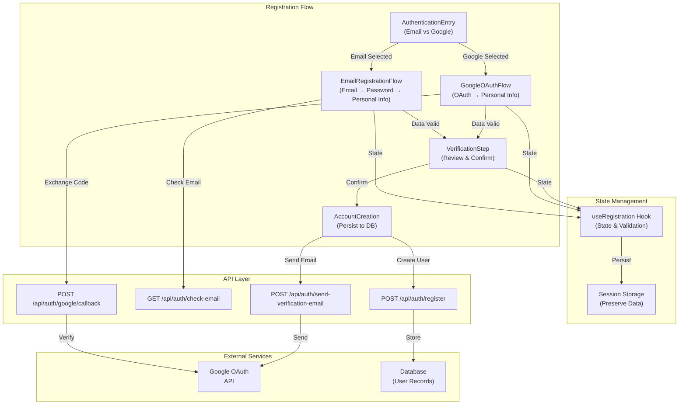
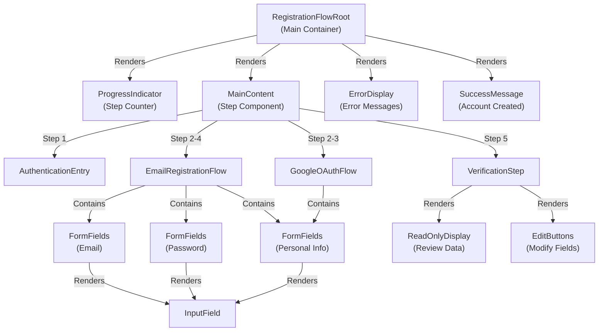

# Design Document - Registration Flow Redesign

## Overview

The Registration Flow Redesign introduces a modern, user-friendly multi-step registration process that supports dual authentication methods: email/password and Google OAuth. The flow maintains visual consistency with the login interface using a dark theme (dark blue background #1a1f3a, blue buttons #0070F3) and provides a focused, distraction-free experience by hiding the main menu during registration.

The redesign guides users through a streamlined process:
- **Email Path**: Email → Password → Personal Information → Verification → Account Creation
- **Google OAuth Path**: Google Authorization → Personal Information → Verification → Account Creation

The system prioritizes security (HTTPS, rate limiting, password hashing), accessibility (WCAG 2.1 AA), and responsiveness across all device sizes.

---

## Architecture

### High-Level Architecture Diagram



### Component Hierarchy



---

## Components and Interfaces

### 1. AuthenticationEntry Component

**Purpose**: Initial screen presenting authentication method choices

**Props**:
```typescript
interface AuthenticationEntryProps {
  onEmailSelected: () => void;
  onGoogleSelected: () => void;
  isLoading?: boolean;
}
```

**Features**:
- Display platform logo/branding
- Two prominent buttons: "Sign up with Email" and "Sign up with Google"
- "Back to Login" link
- Dark theme styling
- Responsive layout

**Accessibility**:
- Semantic HTML (buttons with proper roles)
- ARIA labels for buttons
- Keyboard navigation support
- Focus indicators

---

### 2. EmailRegistrationFlow Component

**Purpose**: Multi-step email registration (Email → Password → Personal Info)

**Props**:
```typescript
interface EmailRegistrationFlowProps {
  onComplete: (data: RegistrationData) => void;
  onBack: () => void;
  initialData?: Partial<RegistrationData>;
}
```

**Sub-steps**:

#### 2.1 Email Input Step
- Email validation (RFC 5322)
- Uniqueness check via API
- Error messages for invalid/duplicate emails
- "Next" and "Back" buttons

#### 2.2 Password Setup Step
- Password requirements display
- Real-time validation feedback
- Password strength indicator (Weak/Fair/Good/Strong)
- Show/Hide password toggle
- Confirm password field
- Error messages for mismatches

#### 2.3 Personal Information Step
- Full Name input (2+ characters)
- Birth Date input (DD/MM/YYYY format, 13+ years old)
- Phone Number input (international format support)
- Validation with specific error messages
- "Next" and "Back" buttons

---

### 3. GoogleOAuthFlow Component

**Purpose**: Google OAuth authentication and personal information collection

**Props**:
```typescript
interface GoogleOAuthFlowProps {
  onComplete: (data: RegistrationData) => void;
  onBack: () => void;
  googleClientId: string;
}
```

**Features**:
- Google OAuth authorization redirect
- Extract email and name from Google
- Pre-fill name field (editable)
- Personal information collection (Birth Date, Phone)
- Error handling for authorization failures
- "Try Again" and "Back" buttons

---

### 4. VerificationStep Component

**Purpose**: Review and confirm all entered data before account creation

**Props**:
```typescript
interface VerificationStepProps {
  data: RegistrationData;
  onConfirm: () => void;
  onEdit: (field: string) => void;
  onBack: () => void;
  isLoading?: boolean;
}
```

**Features**:
- Display all data in read-only format
- Email, Full Name, Birth Date, Phone displayed
- Password shown as "Password is set and secured" (email path only)
- "Edit" button for each field
- "Create Account" and "Back" buttons
- Loading state during account creation

---

### 5. ProgressIndicator Component

**Purpose**: Show current step and total steps

**Props**:
```typescript
interface ProgressIndicatorProps {
  currentStep: number;
  totalSteps: number;
  stepLabels: string[];
}
```

**Features**:
- Visual step counter (e.g., "Step 2 of 5")
- Progress bar showing completion percentage
- Step labels
- Responsive design

---

### 6. FormFields Component

**Purpose**: Reusable form field component with validation

**Props**:
```typescript
interface FormFieldProps {
  type: 'email' | 'password' | 'text' | 'date' | 'tel';
  label: string;
  value: string;
  onChange: (value: string) => void;
  onBlur?: () => void;
  error?: string;
  required?: boolean;
  placeholder?: string;
  disabled?: boolean;
  ariaLabel?: string;
  ariaDescription?: string;
}
```

**Features**:
- Input field with label
- Error message display
- Required field indicator
- Placeholder text
- Disabled state
- Accessibility attributes

---

### 7. ErrorDisplay Component

**Purpose**: Display validation and API errors

**Props**:
```typescript
interface ErrorDisplayProps {
  error: string | null;
  onDismiss?: () => void;
  type?: 'field' | 'form' | 'api';
}
```

**Features**:
- Error message display
- Dismiss button
- Different styling for different error types
- Accessible error announcements

---

### 8. SuccessMessage Component

**Purpose**: Display success message after account creation

**Props**:
```typescript
interface SuccessMessageProps {
  message: string;
  redirectUrl: string;
  redirectDelay?: number;
}
```

**Features**:
- Success message display
- Auto-redirect after delay (default 2 seconds)
- Redirect URL configuration

---

## Data Models

### RegistrationData Model

```typescript
interface RegistrationData {
  // Email registration path
  email: string;
  password?: string;
  
  // Google OAuth path
  googleAuthCode?: string;
  googleAccessToken?: string;
  
  // Common fields
  fullName: string;
  birthDate: string; // DD/MM/YYYY format
  phone: string;
  
  // Metadata
  authMethod: 'email' | 'google';
  createdAt: Date;
  sessionId: string;
}
```

### Validation Rules

#### Email Validation
- Format: RFC 5322 standard
- Uniqueness: Check against database
- Accepted domains: All valid TLDs

#### Password Validation
- Minimum 8 characters
- At least 1 uppercase letter (A-Z)
- At least 1 number (0-9)
- At least 1 special character (!@#$%^&*)
- Confirmation must match

#### Full Name Validation
- Minimum 2 characters
- Maximum 100 characters
- Allowed characters: letters, spaces, hyphens, apostrophes
- Trimmed before storage

#### Birth Date Validation
- Format: DD/MM/YYYY
- Valid date (no 32/13/2000)
- Minimum age: 13 years
- Maximum age: 120 years
- No future dates

#### Phone Number Validation
- International format support
- Accepts with/without formatting (spaces, hyphens, parentheses)
- Normalized to standard format for storage
- Minimum 10 digits

### Session Data Model

```typescript
interface RegistrationSession {
  sessionId: string;
  data: RegistrationData;
  createdAt: Date;
  expiresAt: Date; // 30 minutes from creation
  ipAddress: string;
  userAgent: string;
}
```

---

## Correctness Properties

*A property is a characteristic or behavior that should hold true across all valid executions of a system—essentially, a formal statement about what the system should do. Properties serve as the bridge between human-readable specifications and machine-verifiable correctness guarantees.*

### Property 1: Email Format Validation Consistency

**For any** email address, the validation function SHALL consistently accept valid RFC 5322 formatted emails and reject invalid formats across all invocations.

**Validates: Requirements 2.3, 15.1-15.5**

**Rationale**: Email validation must be deterministic and consistent to prevent users from being rejected for valid emails.

---

### Property 2: Password Strength Validation Correctness

**For any** password string, the validation function SHALL accept passwords meeting all requirements (8+ characters, uppercase, number, special character) and reject passwords missing any requirement.

**Validates: Requirements 3.4, 19.1**

**Rationale**: Password validation must correctly enforce all security requirements without false positives or negatives.

---

### Property 3: Password Hashing Security

**For any** password, hashing the same password multiple times SHALL produce different hashes (due to salt), but verification SHALL succeed for all hashes.

**Validates: Requirements 8.4, 19.3**

**Rationale**: Password hashing must use salts to prevent rainbow table attacks while maintaining verification consistency.

---

### Property 4: Full Name Validation Correctness

**For any** name string, the validation function SHALL accept names with 2+ characters and reject names with fewer than 2 characters.

**Validates: Requirements 4.3-4.5, 17.1-17.3**

**Rationale**: Name validation must enforce minimum length requirements consistently.

---

### Property 5: Birth Date Format Validation

**For any** date string, the validation function SHALL accept valid DD/MM/YYYY formatted dates and reject invalid formats or impossible dates.

**Validates: Requirements 4.8-4.9, 18.1-18.2**

**Rationale**: Birth date validation must enforce correct format and reject invalid dates.

---

### Property 6: Age Validation Correctness

**For any** birth date, age calculation SHALL correctly determine if the user is at least 13 years old, rejecting users under 13 and accepting users 13 and older.

**Validates: Requirements 4.10-4.11, 6.10-6.11, 18.3**

**Rationale**: Age validation must be accurate to comply with legal requirements (COPPA).

---

### Property 7: Phone Number Format Validation

**For any** phone number string, the validation function SHALL accept valid international phone formats and reject invalid formats.

**Validates: Requirements 4.13-4.14, 6.12-6.13, 16.1-16.2**

**Rationale**: Phone number validation must support international formats consistently.

---

### Property 8: Phone Number Normalization Consistency

**For any** valid phone number in various formats (with/without spaces, hyphens, parentheses), the system SHALL normalize it to a standard format for storage and the normalized format SHALL be consistent across multiple normalizations of the same input.

**Validates: Requirements 4.15, 6.15, 16.4**

**Rationale**: Phone numbers must be normalized consistently to ensure data quality and searchability.

---

### Property 9: Email Uniqueness Enforcement

**For any** registered email, attempting to register with the same email again SHALL fail with a 409 Conflict error.

**Validates: Requirements 2.5, 15.3, 24.7**

**Rationale**: Email uniqueness must be enforced to prevent duplicate accounts.

---

### Property 10: Final Data Validation Completeness

**For any** registration data set, final validation before account creation SHALL accept all valid data and reject any data with invalid fields.

**Validates: Requirements 8.1-8.2**

**Rationale**: Final validation must catch all invalid data before persisting to database.

---

### Property 11: Session Data Preservation

**For any** registration data entered during a session, the data SHALL be retrievable from session storage without loss or corruption.

**Validates: Requirements 14.1, 14.4**

**Rationale**: Session data must be preserved accurately throughout the registration process.

---

### Property 12: Session Data Cleanup

**For any** completed or cancelled registration, session data SHALL be cleared and no longer retrievable.

**Validates: Requirements 14.4**

**Rationale**: Session data must be cleaned up to prevent data leakage and ensure privacy.

---

## Error Handling

### Validation Errors

| Error Type | Message | Recovery |
|-----------|---------|----------|
| Invalid Email Format | "Please enter a valid email address" | User re-enters email |
| Email Already Registered | "This email is already registered" | User enters different email |
| Invalid Password | "Password must contain at least 8 characters, 1 uppercase letter, 1 number, and 1 special character" | User updates password |
| Passwords Don't Match | "Passwords do not match" | User re-enters confirmation |
| Invalid Name | "Full name must contain at least 2 characters" | User updates name |
| Invalid Birth Date | "Please enter a valid date (DD/MM/YYYY)" | User re-enters date |
| User Too Young | "You must be at least 13 years old to register" | User cannot proceed |
| Invalid Phone | "Please enter a valid phone number" | User re-enters phone |

### API Errors

| Error Type | Message | Recovery |
|-----------|---------|----------|
| Email Check Failed | "Unable to verify email. Please try again." | Retry button |
| Google Auth Failed | "Google authorization failed. Please try again." | Try Again button |
| Account Creation Failed | "Account creation failed. Please try again." | Retry button |
| Network Error | "Network error. Please check your connection." | Retry button |
| Server Error | "Server error. Please try again later." | Retry button |
| Rate Limit Exceeded | "Too many requests. Please try again later." | Wait and retry |

### Session Errors

| Error Type | Message | Recovery |
|-----------|---------|----------|
| Session Expired | "Your session has expired. Please start over." | Redirect to start |
| Session Not Found | "Session not found. Please start over." | Redirect to start |

---

## Testing Strategy

### Unit Tests

#### Email Validation Tests
- Valid email formats (various TLDs, subdomains)
- Invalid email formats (missing @, invalid characters)
- Edge cases (very long emails, special characters)

#### Password Validation Tests
- Valid passwords (meeting all requirements)
- Invalid passwords (missing uppercase, number, special char)
- Password confirmation matching
- Password strength indicator accuracy

#### Name Validation Tests
- Valid names (2+ characters, various scripts)
- Invalid names (empty, 1 character, only numbers)
- Name trimming and normalization

#### Birth Date Validation Tests
- Valid dates (various formats, edge cases)
- Invalid dates (32/13/2000, future dates)
- Age calculation accuracy (13+ years old)

#### Phone Number Validation Tests
- Valid phone numbers (various formats, international)
- Invalid phone numbers (too short, invalid characters)
- Phone number normalization

### Integration Tests

#### Email Uniqueness Check
- Check email availability via API
- Verify 409 Conflict for duplicate emails
- Verify response time < 500ms

#### Account Creation
- Create account with email registration
- Create account with Google OAuth
- Verify user data stored correctly
- Verify password hashed securely

#### Google OAuth Flow
- Exchange authorization code for token
- Extract email and name from Google
- Handle authorization failures

#### Session Management
- Create registration session
- Preserve data across steps
- Expire session after 30 minutes
- Clear session on completion

### Property-Based Tests

#### Email Format Validation Consistency (Property 1)
- **Framework**: fast-check (JavaScript) or Hypothesis (Python)
- **Generator**: Valid RFC 5322 email addresses and invalid formats
- **Property**: Valid emails consistently accepted, invalid emails consistently rejected
- **Iterations**: 100+
- **Tag**: Feature: registration-flow-redesign, Property 1: Email Format Validation Consistency

#### Password Strength Validation Correctness (Property 2)
- **Framework**: fast-check
- **Generator**: Passwords with various combinations of length, uppercase, numbers, special chars
- **Property**: Passwords meeting all requirements accepted, missing any requirement rejected
- **Iterations**: 100+
- **Tag**: Feature: registration-flow-redesign, Property 2: Password Strength Validation Correctness

#### Password Hashing Security (Property 3)
- **Framework**: fast-check
- **Generator**: Valid passwords
- **Property**: Different hashes for same password (due to salt), but verification succeeds for all
- **Iterations**: 100+
- **Tag**: Feature: registration-flow-redesign, Property 3: Password Hashing Security

#### Full Name Validation Correctness (Property 4)
- **Framework**: fast-check
- **Generator**: Name strings of various lengths and characters
- **Property**: Names with 2+ characters accepted, names with <2 characters rejected
- **Iterations**: 100+
- **Tag**: Feature: registration-flow-redesign, Property 4: Full Name Validation Correctness

#### Birth Date Format Validation (Property 5)
- **Framework**: fast-check
- **Generator**: Date strings in various formats and invalid dates
- **Property**: Valid DD/MM/YYYY dates accepted, invalid formats/dates rejected
- **Iterations**: 100+
- **Tag**: Feature: registration-flow-redesign, Property 5: Birth Date Format Validation

#### Age Validation Correctness (Property 6)
- **Framework**: fast-check
- **Generator**: Birth dates (under 13, 13+, edge cases, future dates)
- **Property**: Users under 13 rejected, users 13+ accepted, future dates rejected
- **Iterations**: 100+
- **Tag**: Feature: registration-flow-redesign, Property 6: Age Validation Correctness

#### Phone Number Format Validation (Property 7)
- **Framework**: fast-check
- **Generator**: Phone numbers in various formats and invalid formats
- **Property**: Valid international phone formats accepted, invalid formats rejected
- **Iterations**: 100+
- **Tag**: Feature: registration-flow-redesign, Property 7: Phone Number Format Validation

#### Phone Number Normalization Consistency (Property 8)
- **Framework**: fast-check
- **Generator**: Phone numbers in various formats (spaces, hyphens, parentheses)
- **Property**: Normalized format consistent across multiple normalizations of same input
- **Iterations**: 100+
- **Tag**: Feature: registration-flow-redesign, Property 8: Phone Number Normalization Consistency

#### Email Uniqueness Enforcement (Property 9)
- **Framework**: fast-check
- **Generator**: Email addresses
- **Property**: Duplicate emails rejected with 409 Conflict status
- **Iterations**: 100+
- **Tag**: Feature: registration-flow-redesign, Property 9: Email Uniqueness Enforcement

#### Final Data Validation Completeness (Property 10)
- **Framework**: fast-check
- **Generator**: Complete registration data sets with valid and invalid fields
- **Property**: All valid data accepted, any invalid field causes rejection
- **Iterations**: 100+
- **Tag**: Feature: registration-flow-redesign, Property 10: Final Data Validation Completeness

#### Session Data Preservation (Property 11)
- **Framework**: fast-check
- **Generator**: Registration data sets
- **Property**: Data stored in session is retrievable without loss or corruption
- **Iterations**: 100+
- **Tag**: Feature: registration-flow-redesign, Property 11: Session Data Preservation

#### Session Data Cleanup (Property 12)
- **Framework**: fast-check
- **Generator**: Registration data sets
- **Property**: After completion/cancellation, session data is cleared and not retrievable
- **Iterations**: 100+
- **Tag**: Feature: registration-flow-redesign, Property 12: Session Data Cleanup

### Performance Tests

#### Load Time Tests
- Initial Authentication Entry load: < 2 seconds (4G)
- Registration step display: < 1 second
- Email uniqueness check: < 500ms
- Account creation: < 3 seconds

#### Bundle Size Tests
- Code splitting for registration flow
- Lazy load Google OAuth library
- Monitor bundle size growth

### Accessibility Tests

#### WCAG 2.1 AA Compliance
- Color contrast ratios (4.5:1 for text)
- Keyboard navigation (Tab, Enter, Escape)
- Focus indicators visible
- Screen reader compatibility
- ARIA labels and descriptions

#### Manual Testing
- Test with screen readers (NVDA, JAWS)
- Test keyboard-only navigation
- Test with browser zoom (200%)
- Test with high contrast mode

### Responsive Design Tests

#### Desktop (≥1024px)
- Full layout with all elements visible
- Proper spacing and alignment

#### Tablet (768px-1023px)
- Single-column layout
- Touch-friendly button sizes (44x44px)
- Readable text (16px minimum)

#### Mobile (<768px)
- Single-column layout
- Full-width inputs
- Touch-friendly buttons
- No horizontal scrolling

---

## Visual Design Specifications

### Color Palette

| Element | Color | Hex Code |
|---------|-------|----------|
| Background | Dark Blue | #1a1f3a |
| Card Background | Darker Blue | #0f1419 |
| Primary Button | Blue | #0070F3 |
| Primary Button Hover | Darker Blue | #0051cc |
| Text Primary | Light Gray | #e0e0e0 |
| Text Secondary | Medium Gray | #a0a0a0 |
| Error | Red | #ff4444 |
| Success | Green | #44aa44 |
| Border | Dark Gray | #333333 |

### Typography

| Element | Font | Size | Weight |
|---------|------|------|--------|
| Heading 1 | Inter | 32px | 700 |
| Heading 2 | Inter | 24px | 700 |
| Body | Inter | 16px | 400 |
| Label | Inter | 14px | 500 |
| Small | Inter | 12px | 400 |

### Spacing

| Element | Value |
|---------|-------|
| Container Padding | 24px |
| Card Padding | 32px |
| Field Margin | 16px |
| Button Height | 48px |
| Border Radius | 8px |

### Responsive Breakpoints

| Device | Width | Layout |
|--------|-------|--------|
| Mobile | < 768px | Single column |
| Tablet | 768px - 1023px | Single column |
| Desktop | ≥ 1024px | Centered card |

---

## Security Considerations

### HTTPS Enforcement
- All registration endpoints require HTTPS
- HTTP requests redirected to HTTPS
- HSTS header set (max-age: 31536000)

### Password Security
- Minimum 8 characters with complexity requirements
- Hashed using bcrypt (cost factor ≥ 10)
- Never stored in plain text
- Never logged or displayed

### Rate Limiting
- Email validation: 5 requests per minute per IP
- Account creation: 3 requests per hour per IP
- Returns 429 Too Many Requests when exceeded

### CSRF Protection
- CSRF tokens on all forms
- Token validation on server
- SameSite cookie attribute set

### Session Security
- HTTP-only cookies (no JavaScript access)
- Secure flag set (HTTPS only)
- 30-minute expiration
- Regenerate session ID after login

### Data Validation
- All inputs validated on client and server
- Whitelist allowed characters
- Sanitize output to prevent XSS
- Parameterized queries to prevent SQL injection

---

## API Integration Points

### 1. POST /api/auth/register

**Purpose**: Create a new user account

**Request**:
```json
{
  "email": "user@example.com",
  "password": "HashedPassword123!", // Only for email registration
  "fullName": "John Doe",
  "birthDate": "01/01/1990",
  "phone": "+1234567890",
  "authMethod": "email" | "google",
  "googleAccessToken": "token..." // Only for Google OAuth
}
```

**Response (Success)**:
```json
{
  "success": true,
  "userId": "user_123",
  "message": "Account created successfully"
}
```

**Response (Error)**:
```json
{
  "success": false,
  "error": "Email already registered",
  "statusCode": 409
}
```

---

### 2. GET /api/auth/check-email

**Purpose**: Check if email is already registered

**Query Parameters**:
- `email`: Email address to check

**Response (Available)**:
```json
{
  "available": true,
  "email": "user@example.com"
}
```

**Response (Taken)**:
```json
{
  "available": false,
  "email": "user@example.com"
}
```

---

### 3. POST /api/auth/google/callback

**Purpose**: Exchange Google authorization code for access token

**Request**:
```json
{
  "code": "authorization_code",
  "redirectUri": "https://example.com/auth/google/callback"
}
```

**Response (Success)**:
```json
{
  "success": true,
  "email": "user@gmail.com",
  "name": "John Doe",
  "accessToken": "token..." // Stored securely on server
}
```

**Response (Error)**:
```json
{
  "success": false,
  "error": "Invalid authorization code",
  "statusCode": 400
}
```

---

### 4. POST /api/auth/send-verification-email

**Purpose**: Send verification email to user

**Request**:
```json
{
  "email": "user@example.com",
  "userId": "user_123"
}
```

**Response (Success)**:
```json
{
  "success": true,
  "message": "Verification email sent"
}
```

---

## Implementation Notes

### State Management with useRegistration Hook

```typescript
interface UseRegistrationReturn {
  // State
  currentStep: number;
  data: RegistrationData;
  errors: Record<string, string>;
  isLoading: boolean;
  
  // Actions
  setEmail: (email: string) => Promise<void>;
  setPassword: (password: string) => void;
  setPersonalInfo: (info: PersonalInfo) => void;
  validateStep: () => boolean;
  nextStep: () => void;
  previousStep: () => void;
  editField: (field: string) => void;
  submitRegistration: () => Promise<void>;
  reset: () => void;
}
```

### Session Storage Strategy

- Store registration data in sessionStorage (cleared on browser close)
- Encrypt sensitive data (passwords) before storage
- Validate data integrity on retrieval
- Clear data on successful registration or cancellation

### Google OAuth Configuration

- Client ID from Google Cloud Console
- Redirect URI: `https://example.com/auth/google/callback`
- Scopes: `email`, `profile`
- Store access token securely on server (not in browser)

---

## Future Enhancements

### Email Verification (Requirement 28)
- Send verification email after account creation
- Unique verification link (24-hour expiration)
- Mark email as verified when link clicked
- Prompt for email verification on login

### Additional OAuth Providers (Requirement 29)
- GitHub OAuth integration
- Microsoft OAuth integration
- Apple OAuth integration
- Consistent personal information collection

### Two-Factor Authentication
- SMS or email-based 2FA
- TOTP support
- Backup codes

### Social Profile Linking
- Link multiple OAuth providers to single account
- Merge accounts with same email
- Unlink OAuth providers

---

## Deployment Checklist

- [ ] Environment variables configured (Google Client ID, API endpoints)
- [ ] HTTPS certificate installed
- [ ] Rate limiting configured
- [ ] Database migrations applied
- [ ] Email service configured
- [ ] Logging and monitoring enabled
- [ ] Security headers configured
- [ ] CORS policies configured
- [ ] Performance optimized
- [ ] Accessibility tested
- [ ] Load testing completed
- [ ] Security audit completed
