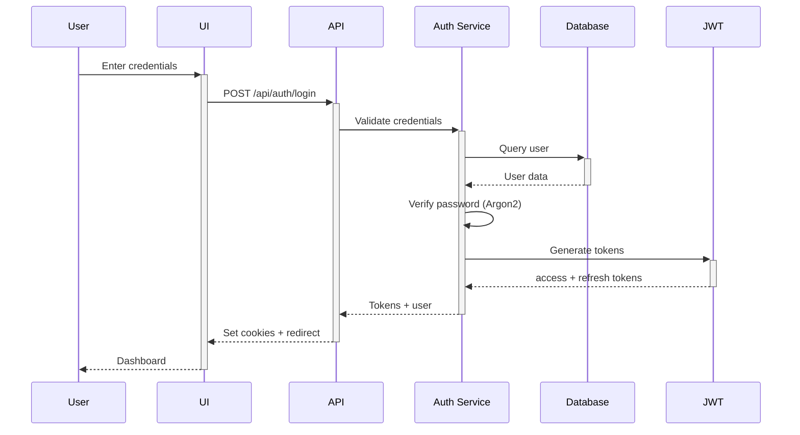
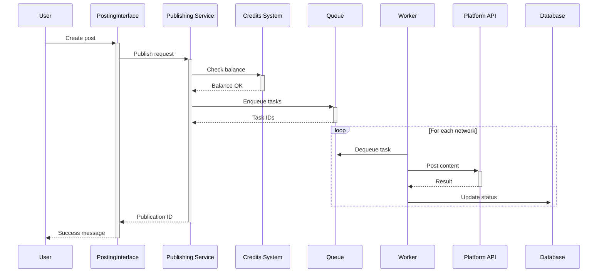

# Architecture Documentation

> System design, patterns, and technical decisions

## 📐 Architecture Overview

gabrieltoth.com follows **Clean Architecture** principles with clear separation of concerns.

```
┌─────────────────────────────────────────────────┐
│              Presentation Layer                  │
│  (Next.js App Router, React Components, UI)     │
└──────────────────┬──────────────────────────────┘
                   │
┌──────────────────▼──────────────────────────────┐
│            Application Layer                     │
│     (Use Cases, Business Logic, Services)       │
└──────────────────┬──────────────────────────────┘
                   │
┌──────────────────▼──────────────────────────────┐
│             Domain Layer                         │
│  (Entities, Value Objects, Domain Rules)        │
└──────────────────┬──────────────────────────────┘
                   │
┌──────────────────▼──────────────────────────────┐
│          Infrastructure Layer                    │
│ (Database, External APIs, File System, Cache)   │
└─────────────────────────────────────────────────┘
```

## 🏛️ Core Principles

### 1. Zero Cost
- All infrastructure runs on free tiers
- No paid APIs (OpenAI, Claude, etc.)
- Local-first development

### 2. Clean Architecture
```
src/
├── domain/          # Core business entities (ZERO dependencies)
├── application/     # Use cases + ports
├── infrastructure/  # Adapters (DB, APIs, cache)
└── presentation/    # UI components + routes
```

**Dependency Rule**: Outer layers depend on inner layers, never the reverse.

### 3. i18n First
- 4 languages: EN, PT-BR, ES, DE
- All UI strings externalized
- Server-side rendering with locale detection

## 🗄️ Data Flow

### Authentication Flow


### Publishing Flow


## 🔐 Security Architecture

### Authentication
- **JWT** for stateless auth
- **Refresh tokens** stored in HTTP-only cookies
- **Argon2id** for password hashing
- **CSRF tokens** for state mutations

### Rate Limiting
- **Redis-backed** sliding window
- **Per-endpoint** limits:
  - Login/Register: 5 req/15min
  - API calls: 100 req/1min
  - Publishing: 10 req/1min

### Input Validation
- **Zod** schemas at API boundary
- **Server-side** validation always
- **Client-side** for UX only

## 📊 Database Schema

### Core Tables

```sql
-- Users
users (
  id UUID PRIMARY KEY,
  email TEXT UNIQUE NOT NULL,
  name TEXT NOT NULL,
  password_hash TEXT NOT NULL,
  email_verified BOOLEAN DEFAULT FALSE,
  created_at TIMESTAMP DEFAULT NOW()
)

-- Connected Channels
channels (
  id UUID PRIMARY KEY,
  user_id UUID REFERENCES users(id),
  platform TEXT NOT NULL, -- 'youtube' | 'twitch' | 'kick'
  platform_channel_id TEXT NOT NULL,
  access_token_encrypted TEXT NOT NULL,
  refresh_token_encrypted TEXT,
  connected_at TIMESTAMP DEFAULT NOW(),
  UNIQUE(user_id, platform, platform_channel_id)
)

-- Publications
publications (
  id UUID PRIMARY KEY,
  user_id UUID REFERENCES users(id),
  content TEXT NOT NULL,
  status TEXT NOT NULL, -- 'pending' | 'published' | 'failed'
  scheduled_at TIMESTAMP,
  published_at TIMESTAMP,
  created_at TIMESTAMP DEFAULT NOW()
)

-- Publication Network Status
publication_networks (
  id UUID PRIMARY KEY,
  publication_id UUID REFERENCES publications(id),
  network TEXT NOT NULL,
  status TEXT NOT NULL,
  error_message TEXT,
  external_id TEXT
)
```

### Encryption
- **Token encryption**: AES-256-GCM
- **Key derivation**: PBKDF2 with pepper
- **Key storage**: Environment variables only

## 🚀 Deployment Architecture

### Production Stack
```
┌─────────────────┐
│   Vercel Edge   │ ← Next.js App (SSR + API Routes)
└────────┬────────┘
         │
┌────────▼────────┐
│   Supabase      │ ← PostgreSQL + Auth
└────────┬────────┘
         │
┌────────▼────────┐
│   Upstash       │ ← Redis (rate limiting + cache)
└─────────────────┘
```

### CI/CD Pipeline
```yaml
# .github/workflows/quality-check.yml
Push → Format → Lint → Type-check → i18n → Spell → Tests → Deploy
```

## 📦 Module Structure

### Feature Modules
```
src/lib/
├── auth/           # Authentication + authorization
├── channels/       # Social media integrations
├── publishing/     # Content publishing engine
├── analytics/      # Metrics + insights
├── credits/        # Credit system
└── notifications/  # User notifications
```

### Shared Infrastructure
```
src/lib/
├── db/             # Database client + migrations
├── cache/          # Redis abstraction
├── encryption/     # Token encryption utilities
├── validation/     # Zod schemas
└── errors/         # Error handling
```

## 🔄 State Management

### Client State
- **React Context** for auth state
- **URL state** for filters/pagination
- **Local storage** for user preferences

### Server State
- **React Query** (TanStack Query) for API data
- **Optimistic updates** for better UX
- **Background refetch** on focus

## 🌐 API Design

### RESTful Conventions
```
GET    /api/resource       → List all
GET    /api/resource/:id   → Get one
POST   /api/resource       → Create
PATCH  /api/resource/:id   → Update
DELETE /api/resource/:id   → Delete
```

### Response Format
```typescript
{
  data: T | T[],
  error?: { code: string, message: string },
  pagination?: { page: number, limit: number, total: number }
}
```

## 🧪 Testing Strategy

### Test Pyramid
```
        ┌─────────┐
        │   E2E   │ (Playwright)
        └─────────┘
      ┌─────────────┐
      │ Integration │ (Vitest + MSW)
      └─────────────┘
    ┌───────────────────┐
    │   Unit Tests      │ (Vitest)
    └───────────────────┘
```

### Coverage Goals
- **Unit tests**: >80% coverage
- **Integration tests**: Critical flows
- **E2E tests**: Happy paths only

## 📈 Performance

### Optimization Strategies
- **Static generation** for marketing pages
- **ISR** (Incremental Static Regeneration) for dashboard
- **Edge caching** for API responses
- **Image optimization** via Next.js Image
- **Code splitting** at route level

### Performance Budget
- **FCP** (First Contentful Paint): < 1.5s
- **LCP** (Largest Contentful Paint): < 2.5s
- **TTI** (Time to Interactive): < 3.5s
- **Bundle size**: < 300KB (gzipped)

## 🔍 Monitoring

### Observability Stack
- **Vercel Analytics** for Web Vitals
- **Supabase Logs** for database queries
- **Custom logging** to Discord webhook
- **Error tracking** via structured logs

### Alerts
- API errors > 5% in 5min window
- Database connection failures
- Rate limit threshold (80% capacity)

---

## 🛠️ Technology Decisions

### Why Next.js?
- ✅ SSR + SSG out of the box
- ✅ API routes (no separate backend)
- ✅ Built-in optimizations
- ✅ Vercel free tier

### Why Supabase?
- ✅ PostgreSQL + auth + realtime
- ✅ Generous free tier
- ✅ Auto-generated REST API
- ✅ Row Level Security (RLS)

### Why Tailwind CSS?
- ✅ Utility-first (fast development)
- ✅ Tree-shakeable (small bundle)
- ✅ Design system consistency
- ✅ Dark mode built-in

---

**Last updated**: 2026-07-26  
**Architecture Version**: 1.0
