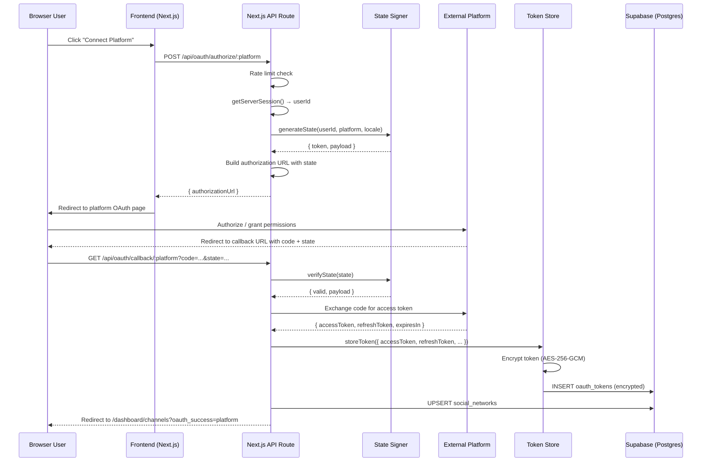
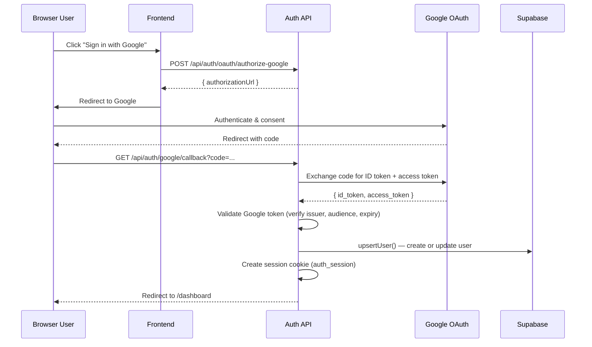

# OAuth Flow Architecture

Comprehensive documentation of the OAuth 2.0 authorization architecture across all
platforms integrated with gabrieltoth.com.

**Last updated:** 2026-07-12

---

## Table of Contents

1. [Architecture Overview](#1-architecture-overview)
2. [Authentication Patterns](#2-authentication-patterns)
3. [Token Encryption (AES-256-GCM)](#3-token-encryption-aes-256-gcm)
4. [HMAC State Signing](#4-hmac-state-signing)
5. [Platform Variations](#5-platform-variations)
6. [Error Handling](#6-error-handling)
7. [Environment Variables Reference](#7-environment-variables-reference)
8. [Security Considerations](#8-security-considerations)
9. [Login OAuth (Authentication)](#9-login-oauth-authentication)
10. [Related Source Files](#10-related-source-files)

---

## 1. Architecture Overview

Applications integrate with external platforms via OAuth 2.0 (and OAuth 1.0a for
Twitter/X). The flow follows the standard authorization code grant pattern with
additional security layers (HMAC state signing, AES-256-GCM token encryption).

### High-Level Flow



### Architecture Decisions

| Decision | Rationale |
|----------|-----------|
| Stateless HMAC state (no Redis) | Each state token contains its own proof via HMAC-SHA256 signature. No external cache needed. |
| Server-side token exchange | Authorization code is exchanged for tokens server-side — the code never reaches the browser. |
| Encrypted token storage at rest | All OAuth tokens are AES-256-GCM encrypted before being stored in the database. |
| Session-based auth for API routes | All OAuth endpoints use `getServerSession()` to read the `auth_session` cookie. |

---

## 2. Authentication Patterns

OAuth API routes authenticate the user making the request via the session cookie.

### Primary Pattern: Session Cookie (Preferred)

**Source:** `src/lib/auth/get-server-session.ts`

```typescript
import { getSessionFromCookie } from "./session"
import { NextRequest } from "next/server"

export async function getServerSession(request: NextRequest) {
    const session = await getSessionFromCookie(request)
    if (!session) return null
    return { user: { id: session.user_id } }
}
```

- Reads the `auth_session` HTTP cookie (set by the auth API after login)
- Returns `{ user: { id: string } }` or `null`
- Used by all OAuth authorize endpoints (POST), callback endpoints (GET), and disconnect endpoints

### Deprecated Pattern: Header-Based

The legacy `x-user-id` header pattern is deprecated and should not be used for
new code. All current OAuth routes rely exclusively on the session cookie.

---

## 3. Token Encryption (AES-256-GCM)

**Source:** `src/lib/youtube/token-encryption.ts`

All OAuth access tokens are encrypted before storage using AES-256-GCM.

### Algorithm

- **Cipher:** AES-256-GCM (authenticated encryption)
- **Key length:** 256 bits (32 bytes)
- **IV length:** 12 bytes (96 bits, recommended for GCM)
- **Authentication tag length:** 16 bytes (128 bits)

### Output Format

The encrypted token is a base64-encoded concatenation of:

```
base64(IV || AuthTag || Ciphertext)
```

Where:
- `IV` = 12 random bytes
- `AuthTag` = 16 bytes (GCM authentication tag)
- `Ciphertext` = encrypted token data (hex-encoded during encryption)

### Key Management

Three strategies are supported, selected via `TOKEN_ENCRYPTION_STRATEGY`:

| Strategy | Env Var | Description |
|----------|---------|-------------|
| `environment` (default) | `TOKEN_ENCRYPTION_KEY` | 64-char hex string (32 bytes). Validated for length and hex format. |
| `local-file` | `TOKEN_ENCRYPTION_KEY_PATH` | Path to a file containing the hex key. |
| `aws-kms` | `AWS_KMS_KEY_ID` | Not yet implemented — throws error if used. |

### Singleton

A single `TokenEncryptionService` instance is created via `getTokenEncryptionService()`
and shared across the application. The encryption key is cached in memory after the
first retrieval.

### Usage

```typescript
const service = getTokenEncryptionService()
const { encryptedToken } = await service.encrypt("ya29.a0AfH6SMBx...")
// encryptedToken: base64 string

const { token } = await service.decrypt(encryptedToken)
// token: original access token
```

---

## 4. HMAC State Signing

**Source:** `src/lib/oauth/state-signer.ts`

OAuth state parameters are cryptographically signed using HMAC-SHA256. This
eliminates the need for an external cache (Redis, database) — the state IS the
proof.

### State Token Format

```
base64url(payload) . base64url(signature)
```

### Payload Structure

```typescript
interface StatePayload {
    userId: string      // Authenticated user UUID
    platform: string    // "youtube", "facebook", etc.
    nonce: string       // 16 random bytes as hex
    iat: number         // Issued-at timestamp (epoch ms)
    locale?: string     // User's locale for redirect
    redirectTo?: string // Custom redirect target
    codeVerifier?: string // PKCE code verifier (Kick only)
}
```

### Signing

- **Algorithm:** HMAC-SHA256
- **Key source:** `OAUTH_STATE_SECRET` env var (falls back to `TOKEN_ENCRYPTION_KEY`)
- **Expiry:** 10 minutes from `iat`

### Verification

```typescript
const result = verifyState(token)
// { valid: boolean, payload: StatePayload | null, error?: string }
```

Verification checks:
1. Token must contain exactly two parts separated by `.`
2. HMAC signature must match (computed again from the payload part)
3. Payload must contain valid `userId`, `platform`, `nonce`, `iat` fields
4. Token must not be expired (within 10 minutes of `iat`)
5. `iat` must not be in the future

---

## 5. Platform Variations

Each integrated platform has specific OAuth implementation details.

### 5.1 Twitch

| Property | Value |
|----------|-------|
| OAuth version | 2.0 (Authorization Code Grant) |
| Authorize endpoint | Standard `GET` to Twitch OAuth URL |
| Token exchange | Standard `POST` with `authorization_code` |
| Scopes (v1) | `user:read`, `channel:read`, `chat:read`, `chat:edit` |
| State | HMAC-signed state parameter |
| Redirect | Standard callback with `code` + `state` |
| Source | `src/app/api/oauth/authorize/twitch/route.ts` |

### 5.2 Kick

| Property | Value |
|----------|-------|
| OAuth version | 2.0 (Authorization Code Grant + PKCE) |
| PKCE method | S256 (SHA-256 code challenge) |
| Code verifier | 32 random bytes, base64url-encoded |
| Code verifier storage | Embedded in HMAC-signed state payload (`codeVerifier` field) |
| Scopes (v1) | `user:read`, `channel:read`, `chat:write` |
| State | HMAC-signed state containing `codeVerifier` |
| Note | This is the **only** platform using PKCE. The `codeVerifier` is stored in the state token itself (no server-side session needed). |
| Source | `src/app/api/oauth/authorize/kick/route.ts` |

### 5.3 TikTok

| Property | Value |
|----------|-------|
| OAuth version | 2.0 (Authorization Code Grant) |
| Authorize URL | `https://www.tiktok.com/v2/auth/authorize/` |
| Token response | Returns access token + refresh token |
| Token format | TikTok returns a dual-format token response (both `access_token` and scoped tokens) |
| Scopes (v1) | `video.publish`, `user.info.basic` |
| Source | `src/app/api/oauth/authorize/tiktok/route.ts` |

### 5.4 Twitter / X

| Property | Value |
|----------|-------|
| OAuth version | 1.0a (NOT OAuth 2.0) |
| Rationale | New X Developer Console does not support OAuth 2.0 PKCE for the required scopes |
| Request token | `POST` to get request token + secret |
| OAuth session | Request token/secret stored in `oauth_sessions` Supabase table |
| Authorization | Redirect with `oauth_token` |
| Callback | Parameters: `oauth_token` + `oauth_verifier` |
| Token exchange | OAuth 1.0a access token exchange |
| Token lifetime | Non-expiring (sets 1-year expiry in stored token) |
| State | No HMAC state — OAuth 1.0a callback URL is fixed at app registration |
| Replay protection | OAuth session entry is deleted immediately after use |
| Scopes (v1) | `tweet.write`, `tweet.read` |
| Source | `src/app/api/oauth/authorize/twitter/route.ts` |

### 5.5 LinkedIn

| Property | Value |
|----------|-------|
| OAuth version | 2.0 (Authorization Code Grant) |
| Authorize endpoint | Standard LinkedIn OAuth |
| Scopes (v2) | `w_organization_social`, `openid`, `profile`, `email` |
| State | HMAC-signed state parameter |
| Note | Uses `w_organization_social` scope for organization posting (v2 added) |
| Source | `src/app/api/oauth/authorize/linkedin/route.ts` |

### 5.6 Facebook

| Property | Value |
|----------|-------|
| OAuth version | 2.0 (Authorization Code Grant) |
| Authorize URL | `https://www.facebook.com/{apiVersion}/dialog/oauth` |
| Token exchange | Via Facebook's Graph API |
| Page tokens | After initial token, fetches user's pages via `getUserPages()` and stores each page in `social_networks` |
| Long-lived tokens | Facebook page tokens can be extended for longer validity |
| Scopes (v1) | `pages_manage_posts`, `pages_read_engagement` |
| State | HMAC-signed state parameter |
| Source | `src/app/api/oauth/authorize/facebook/route.ts` |
| Webhook verify | `FACEBOOK_WEBHOOK_VERIFY_TOKEN` for webhook subscription verification |

### 5.7 Instagram

| Property | Value |
|----------|-------|
| OAuth version | 2.0 (Authorization Code Grant) |
| Authorize URL | `https://www.facebook.com/{apiVersion}/dialog/oauth` (via Meta's Graph API) |
| Account type | Instagram Business account (required for content publishing) |
| Token exchange | Via Meta's Graph API |
| Scopes (v1) | `instagram_basic`, `instagram_content_publish` |
| State | HMAC-signed state parameter |
| Source | `src/app/api/oauth/authorize/instagram/route.ts` |
| Webhook verify | `INSTAGRAM_WEBHOOK_VERIFY_TOKEN` for webhook subscription verification |

### 5.8 Google / YouTube

| Property | Value |
|----------|-------|
| OAuth version | 2.0 (Authorization Code Grant + OpenID Connect) |
| Authorize endpoint | Google's standard OAuth 2.0 endpoint |
| Token exchange | Google's token endpoint |
| Scopes for **YouTube** | `youtube.readonly` (channel linking/dashboard feature) |
| Channel discovery | After token exchange, calls YouTube Data API v3 `channels?part=snippet&mine=true` to fetch all channels |
| Multiple channels | Supports personal + brand accounts — all channels returned by API are upserted into `social_networks` |
| Source (channel linking) | `src/app/api/oauth/authorize/[platform]/route.ts` (via generic platform route) |
| Source (login) | `src/app/api/auth/oauth/authorize-google/route.ts` |

---

## 6. Error Handling

### OAuth Provider Errors

When the user denies authorization or the platform returns an error, the callback
route redirects to `/{locale}/dashboard/channels` with error parameters:

```
GET /en/dashboard/channels?oauth_error=access_denied&oauth_error_description=User+denied+access
```

### Token Exchange Failure

If token exchange fails (invalid code, network error, provider outage), the user
is redirected to:

```
GET /en/dashboard/channels?oauth_error=callback_failed
```

### State Validation Failure

If the HMAC-signed state is invalid, expired, or tampered with:

```
GET /en/dashboard/channels?oauth_error=invalid_state
```

### Missing Parameters

If `code` or `state` are missing from the callback:

```
GET /en/dashboard/channels?oauth_error=missing_parameters
```

### Unauthenticated Callback

If no valid session is found during callback (user not logged in):

```
GET /auth/login?oauth_error=unauthorized
```

### Rate Limiting

The authorize endpoint is rate-limited per client IP (`oauth:authorize:{ip}`):

- Too many authorize requests return HTTP 429 with `{ error: "Too many requests. Please try again later." }`
- Rate limiter source: `src/lib/rate-limit.ts`

### Discord Alerts

Audit events (platform_linked) are sent to Discord via webhook when an OAuth
connection is established. Source: `src/lib/audit/discord-user-audit.ts`.

---

## 7. Environment Variables Reference

### OAuth Provider Credentials

| Env Var | Platforms | Required |
|---------|-----------|----------|
| `YOUTUBE_CLIENT_ID` | YouTube | For YouTube feature |
| `YOUTUBE_CLIENT_SECRET` | YouTube | For YouTube feature |
| `YOUTUBE_REDIRECT_URI` | YouTube | For YouTube feature |
| `FACEBOOK_APP_ID` | Facebook, Instagram | For FB/IG features |
| `FACEBOOK_APP_SECRET` | Facebook, Instagram | For FB/IG features |
| `FACEBOOK_REDIRECT_URI` | Facebook | For FB feature |
| `INSTAGRAM_APP_ID` | Instagram | For IG feature |
| `INSTAGRAM_APP_SECRET` | Instagram | For IG feature |
| `INSTAGRAM_REDIRECT_URI` | Instagram | For IG feature |
| `TIKTOK_CLIENT_KEY` | TikTok | For TikTok feature |
| `TIKTOK_CLIENT_SECRET` | TikTok | For TikTok feature |
| `TIKTOK_REDIRECT_URI` | TikTok | For TikTok feature |
| `TWITTER_CLIENT_ID` | Twitter/X | For Twitter feature |
| `TWITTER_CLIENT_SECRET` | Twitter/X | For Twitter feature |
| `TWITTER_REDIRECT_URI` | Twitter/X | For Twitter feature |
| `LINKEDIN_CLIENT_ID` | LinkedIn | For LinkedIn feature |
| `LINKEDIN_CLIENT_SECRET` | LinkedIn | For LinkedIn feature |
| `LINKEDIN_REDIRECT_URI` | LinkedIn | For LinkedIn feature |
| `TWITCH_CLIENT_ID` | Twitch | For Twitch feature |
| `TWITCH_CLIENT_SECRET` | Twitch | For Twitch feature |
| `TWITCH_REDIRECT_URI` | Twitch | For Twitch feature |
| `KICK_CLIENT_ID` | Kick | For Kick feature |
| `KICK_CLIENT_SECRET` | Kick | For Kick feature |
| `KICK_REDIRECT_URI` | Kick | For Kick feature |

### Bypass Tokens (Development)

| Env Var | Purpose |
|---------|---------|
| `FACEBOOK_PAGE_ID` | Facebook page ID (bypass OAuth — from Graph API Explorer) |
| `FACEBOOK_PAGE_ACCESS_TOKEN` | Facebook page token (bypass OAuth for development) |
| `INSTAGRAM_BUSINESS_ACCOUNT_ID` | Instagram business ID (bypass OAuth for development) |
| `INSTAGRAM_PAGE_ACCESS_TOKEN` | Instagram page token (bypass OAuth for development) |

### Security & Encryption

| Env Var | Description | Format |
|---------|-------------|--------|
| `OAUTH_STATE_SECRET` | HMAC signing key for OAuth state tokens | 64-character hex |
| `TOKEN_ENCRYPTION_KEY` | AES-256-GCM encryption key for stored tokens | 64-character hex |
| `TOKEN_ENCRYPTION_STRATEGY` | Key management strategy (`environment`, `local-file`, `aws-kms`) | Default: `environment` |
| `TOKEN_ENCRYPTION_KEY_ENV_VAR` | Override env var name for token encryption key | Default: `TOKEN_ENCRYPTION_KEY` |
| `TOKEN_ENCRYPTION_KEY_PATH` | File path for local-file strategy | File must contain 64-char hex |

### Webhooks

| Env Var | Platform |
|---------|----------|
| `FACEBOOK_WEBHOOK_VERIFY_TOKEN` | Facebook (webhook verification handshake) |
| `INSTAGRAM_WEBHOOK_VERIFY_TOKEN` | Instagram (webhook verification handshake) |

---

## 8. Security Considerations

### CSRF Protection

- OAuth authorize requests are protected by the session cookie (CSRF token not
  needed because SameSite cookies are used)
- The HMAC-signed state parameter prevents CSRF on the callback — an attacker
  cannot forge a valid state for a different user

### Token Encryption at Rest

- All access tokens and refresh tokens are encrypted with AES-256-GCM before
  being stored in the `oauth_tokens` table
- The encryption key (`TOKEN_ENCRYPTION_KEY`) is never stored in the database
- Each encryption uses a unique random IV
- GCM authentication tag prevents tampering with ciphertext

### Transport Security

- All OAuth redirects use HTTPS (enforced by platform endpoints)
- Token exchange happens server-to-server — tokens never reach the browser
- Session cookie uses `HttpOnly`, `Secure`, and `SameSite` attributes

### Token Lifetimes

- **Access tokens:** Typically short-lived (1–2 hours). Refresh token used to
  obtain new access tokens.
- **Refresh tokens:** Long-lived, stored encrypted. Rotation should be
  implemented for providers that support it.
- **Twitter/X:** OAuth 1.0a tokens are non-expiring by nature; stored with
  1-year synthetic expiry.

### State Token Security

- HMAC-SHA256 signature prevents tampering — if the payload is modified, the
  signature won't match
- 10-minute expiration limits the window for replay attacks
- Each state contains a random nonce (16 bytes) ensuring uniqueness
- The `iat` check prevents signed tokens from being used indefinitely

### Database-Level Security

- `oauth_tokens` table has Row-Level Security (RLS) enabled
- Users can only access their own tokens (`user_id = auth.uid()`)
- Tokens are encrypted at the application layer — the database never sees
  plaintext tokens

### Replay Protection (Twitter/OAuth 1.0a)

- The `oauth_sessions` entry is deleted immediately after the callback is
  processed, preventing the same `oauth_token` from being reused

---

## 9. Login OAuth (Authentication)

The application supports OAuth-based login flows primarily for Google, with
Facebook and TikTok also available.

### Google Login



**Key behaviors:**

- **New user:** If the email is new, the user is created with `google_email` set
  and redirected to complete registration (password creation)
- **Existing user with password:** Session is created immediately; user is
  redirected to dashboard
- **Existing user without password (migration):** Returns `requiresPassword` flag
  so the user can set a password

**Session creation:** Sets the `auth_session` HTTP cookie via `setSessionCookie()`
in `src/lib/auth/session.ts`.

### Facebook & TikTok Login

These providers also support login via their respective OAuth endpoints through
the generic `GET/POST /api/auth/oauth/callback` route, which performs token
validation via `validateOAuthToken()` in `src/lib/auth/oauth-validator.ts`.

### SSO Placeholder

The endpoint `POST /api/auth/oauth/authorize-sso` exists for future SSO
integration and currently returns HTTP 501 (Not Implemented).

---

## 10. Related Source Files

### Authorize Routes (Start the OAuth flow)

| File | Platform |
|------|----------|
| `src/app/api/oauth/authorize/[platform]/route.ts` | Generic dynamic route |
| `src/app/api/oauth/authorize/facebook/route.ts` | Facebook |
| `src/app/api/oauth/authorize/twitter/route.ts` | Twitter/X |
| `src/app/api/oauth/authorize/twitch/route.ts` | Twitch |
| `src/app/api/oauth/authorize/tiktok/route.ts` | TikTok |
| `src/app/api/oauth/authorize/instagram/route.ts` | Instagram |
| `src/app/api/oauth/authorize/kick/route.ts` | Kick |
| `src/app/api/oauth/authorize/linkedin/route.ts` | LinkedIn |

### Callback Routes (Handle the OAuth redirect)

| File | Platform |
|------|----------|
| `src/app/api/oauth/callback/[platform]/route.ts` | Generic dynamic callback |
| `src/app/api/oauth/callback/facebook/route.ts` | Facebook |
| `src/app/api/oauth/callback/twitter/route.ts` | Twitter/X |
| `src/app/api/oauth/callback/twitch/route.ts` | Twitch |
| `src/app/api/oauth/callback/tiktok/route.ts` | TikTok |
| `src/app/api/oauth/callback/instagram/route.ts` | Instagram |
| `src/app/api/oauth/callback/kick/route.ts` | Kick |
| `src/app/api/oauth/callback/linkedin/route.ts` | LinkedIn |

### Disconnect Routes (Revoke access)

| File | Platform |
|------|----------|
| `src/app/api/oauth/disconnect/[platform]/route.ts` | Generic dynamic disconnect |
| `src/app/api/oauth/disconnect/twitch/route.ts` | Twitch |
| `src/app/api/oauth/disconnect/tiktok/route.ts` | TikTok |
| `src/app/api/oauth/disconnect/kick/route.ts` | Kick |
| `src/app/api/oauth/disconnect/instagram/route.ts` | Instagram |
| `src/app/api/oauth/disconnect/facebook/route.ts` | Facebook |

### Auth OAuth (Login flows)

| File | Purpose |
|------|---------|
| `src/app/api/auth/oauth/authorize-google/route.ts` | Google login initiation |
| `src/app/api/auth/oauth/authorize-sso/route.ts` | SSO placeholder |
| `src/app/api/auth/oauth/callback/route.ts` | Generic login OAuth callback |
| `src/app/api/auth/google/callback/route.ts` | Google-specific login callback |

### Core Libraries

| File | Purpose |
|------|---------|
| `src/lib/oauth/state-signer.ts` | HMAC-SHA256 state generation/verification |
| `src/lib/oauth/state-signer.test.ts` | Tests for state signer |
| `src/lib/oauth/oauth-manager-core.ts` | OAuthManager class — orchestrates all platforms |
| `src/lib/oauth/oauth-types.ts` | Shared types (`OAuthPlatform`, `OAuthConfig`, etc.) |
| `src/lib/oauth/scope-versions.ts` | Scope version tracking per platform |
| `src/lib/youtube/token-encryption.ts` | AES-256-GCM token encryption |
| `src/lib/token-store/token-store.ts` | Token persistence in `oauth_tokens` table |
| `src/lib/auth/get-server-session.ts` | Session extraction from cookie |
| `src/lib/auth/session.ts` | Full session management |
| `src/lib/auth/google-auth.ts` | Google OAuth token exchange + validation |
| `src/lib/auth/oauth-validator.ts` | OAuth token validation |
| `src/lib/config/env.ts` | Environment variable definitions & validation |
| `src/lib/cache/cache-manager.ts` | Redis cache keys: `oauth:token`, `oauth:status` |
| `src/app/api/oauth/status/route.ts` | OAuth connection status endpoint |
